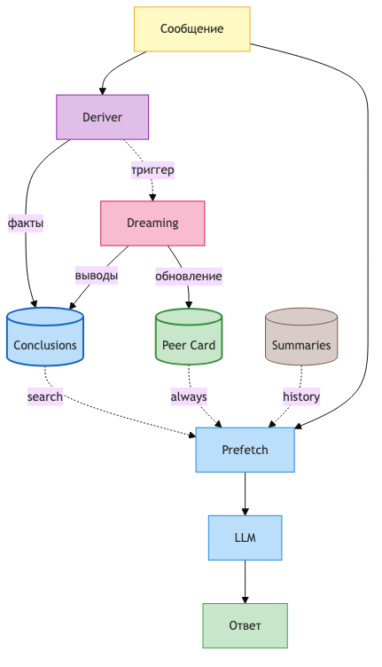
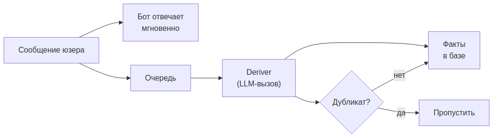
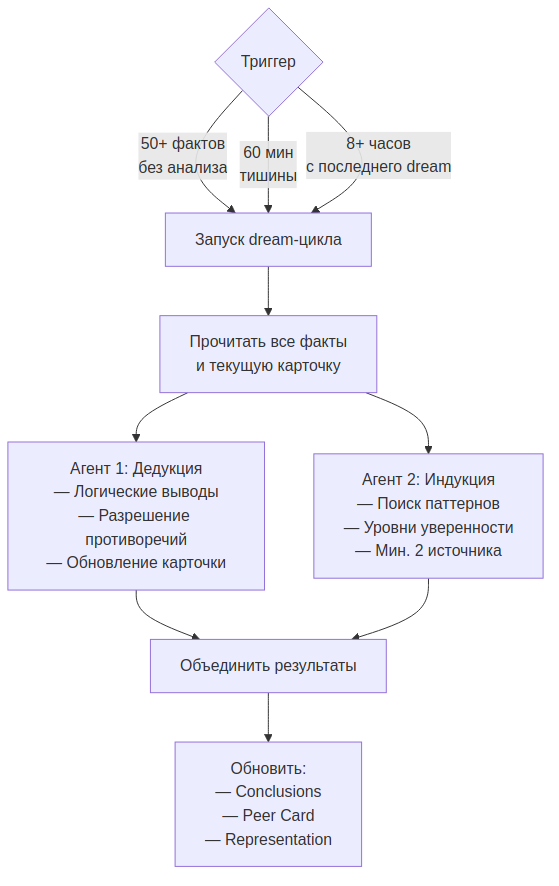
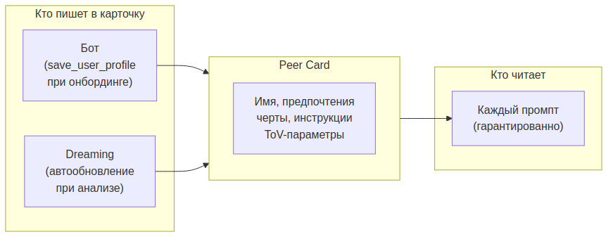
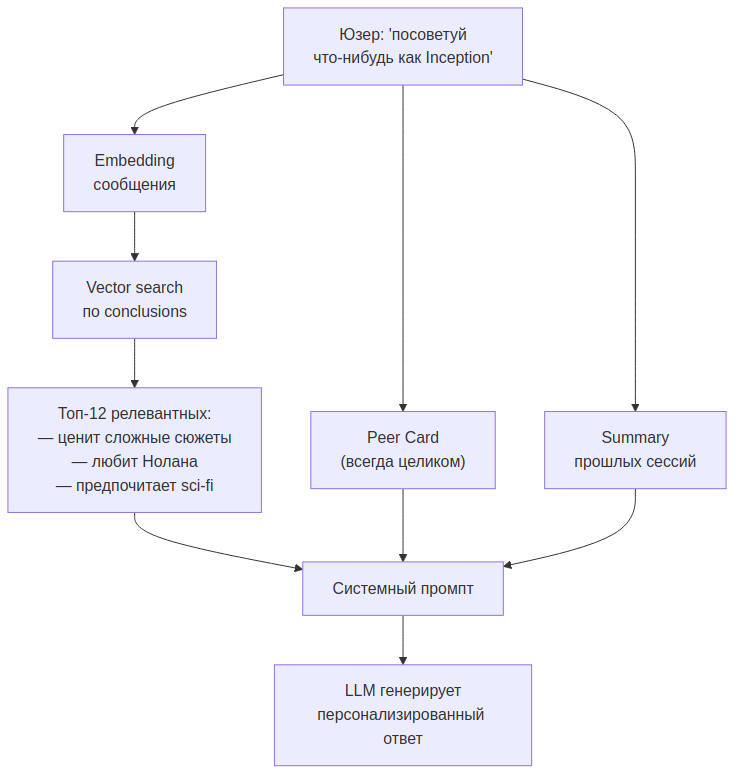
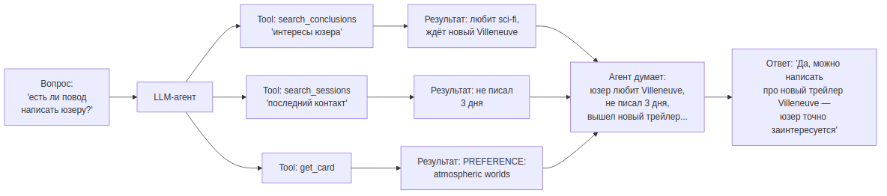
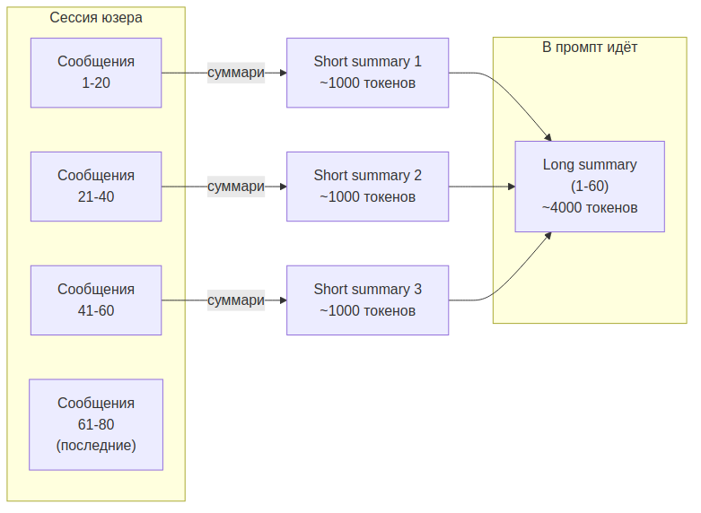
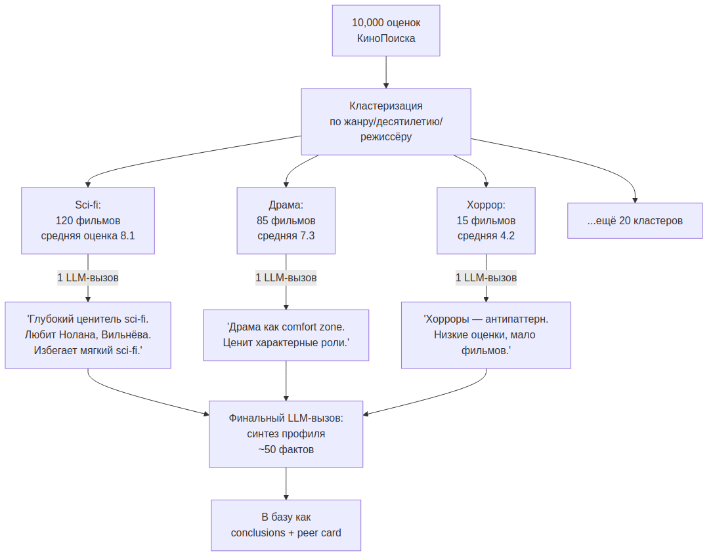

# Honcho: как устроена память — описание эвристик

> **Цель:** понять каждый механизм Honcho — как работает, какие промпты используются, реальные примеры
> **Дата:** 2026-03-26


## Executive Summary

Honcho — open-source платформа для долгосрочной памяти в AI-ботах, которая автоматически строит портрет юзера из его диалогов и подаёт релевантный контекст при каждом ответе. Этот документ описывает **эвристики** каждого механизма: как принимаются решения, какие промпты используются, и как выглядит реальный поток данных.


### Архитектура памяти — overview

{width=50%}

### Ключевые эвристики

- **Память работает в 3 режимах:** realtime (Deriver извлекает факты из каждого сообщения), background (Dreaming анализирует накопленные факты), on-demand (Dialectic отвечает на вопросы о юзере) — каждый режим независим и может внедряться поэтапно.
- **Peer Card — единственный гарантированный контекст.** Все остальные механизмы (conclusions, summaries) фильтруются по релевантности, а карточка юзера попадает в каждый промпт целиком.
- **Dreaming использует формальную логику (дедукция + индукция), а не просто суммаризацию.** Это ключевое отличие от подходов ChatGPT/Gemini и источник качества выводов.
- **Batch-импорт** сжимает 10,000 оценок в ~50 LLM-вызовов через кластеризацию, а не обрабатывает по одной.
- **ChatGPT и Gemini обходятся без vector search** — используют pre-computed flat profile (~30 фактов). Honcho идёт дальше: семантический поиск по сотням conclusions, что даёт точнее контекст, но сложнее в реализации.


## TL;DR

Honcho — это «мозг», который слушает все диалоги бота с юзером и в фоне формирует **портрет юзера**: что любит, как общается, какие паттерны поведения. При каждом новом сообщении бот получает релевантный кусок этого портрета через семантический поиск.

**6 механизмов:**

1. **Deriver** — «секретарь», который записывает факты из каждого сообщения
2. **Dreaming** — «ночной аналитик», который думает над фактами пока юзер спит
3. **Conclusions** — «досье», три типа выводов о юзере
4. **Peer Card** — «визитка», гарантированные факты в каждом промпте
5. **Prefetch** — «портфель», то что бот берёт с собой на каждый разговор
6. **Dialectic** — «консультант», которому можно задать вопрос про юзера

> **Сравнение с конкурентами:** ChatGPT Memory хранит ~30 плоских фактов без reasoning. Gemini Gems — аналогично. Honcho отличается формальной логикой (дедукция/индукция), семантическим поиском по conclusions, и автоматическим разрешением противоречий.


## Содержание

1. [Deriver — секретарь, который записывает факты](#1-deriver--секретарь-который-записывает-факты)
2. [Dreaming — ночной аналитик](#2-dreaming--ночной-аналитик)
3. [Conclusions — досье из трёх типов выводов](#3-conclusions--досье-из-трёх-типов-выводов)
4. [Peer Card — визитка юзера](#4-peer-card--визитка-юзера)
5. [Prefetch — портфель на каждый разговор](#5-prefetch--портфель-на-каждый-разговор)
6. [Dialectic — консультант по памяти](#6-dialectic--консультант-по-памяти)
7. [Суммаризация сессий](#7-суммаризация-сессий)
8. [Batch pipeline — загрузка исторических данных](#8-batch-pipeline--загрузка-исторических-данных)
9. [Общая архитектура — как всё вместе](#9-общая-архитектура--как-всё-вместе)
10. [Сводка: что настраивается в Honcho](#сводка-что-настраивается-в-honcho)
11. [FAQ: конфигурация, приоритеты, использование фактов](#faq-конфигурация-приоритеты-использование-фактов)


## 1. Deriver — секретарь, который записывает факты

### На пальцах

Представь секретаря, который сидит в углу и записывает всё важное из разговора. Юзер написал «я вчера посмотрел Inception, крутой фильм» — секретарь записал:

- Факт: «Юзеру нравится Inception»
- Факт: «Юзер смотрит фильмы»

Секретарь работает **в фоне** — не блокирует ответ бота. Бот ответил сразу, а секретарь записал через секунду-две.

### Как это работает



Deriver — это воркер, который:
1. Берёт новое сообщение из очереди
2. Отправляет его в LLM с промптом «извлеки факты из этого сообщения»
3. Получает структурированный JSON с фактами
4. Проверяет на дубликаты (семантически, не точным совпадением)
5. Сохраняет новые факты в базу

### Реальный пример: от сообщения до фактов

**Диалог:**
```
Юзер: Вчера с женой смотрели Дюну 2, вообще огонь 🔥 Мы обычно по пятницам ходим в кино
Бот: О, Дюна 2 — шикарный фильм! Вильнёв не подвёл. Как вам визуал?
```

**Что извлекает Deriver:**
```json
{
  "facts": [
    {
      "text": "Юзер женат / есть партнёрша",
      "category": "personal"
    },
    {
      "text": "Юзеру понравился фильм Дюна: Часть вторая (2024)",
      "category": "preferences"
    },
    {
      "text": "Юзер ходит в кино по пятницам — регулярная привычка",
      "category": "behavior"
    },
    {
      "text": "Юзер смотрит кино вместе с женой",
      "category": "behavior"
    }
  ]
}
```

**Что НЕ извлекается (и почему):**
- «Вильнёв не подвёл» — это слова бота, не юзера
- «🔥» — эмоция без нового факта, уже покрыта «понравился»
- «вчера» — относительная дата, не факт (если нужна дата — deriver конвертирует в абсолютную)

### Промпт для Deriver

```
You are a fact extraction engine. Given a conversation between a user and
an assistant, extract factual information ONLY about the user.

Rules:
- Extract only facts stated or clearly implied by the USER (not the assistant)
- Each fact must be atomic — one idea per fact
- Deduplicate: if two facts say the same thing, keep the more specific one
- Categories: personal, preferences, behavior, goals, context
- Do NOT extract: greetings, filler words, assistant's statements
- Convert relative dates to absolute when possible
- Output as JSON array

Current user facts already in memory (avoid duplicates):
{existing_facts}

New conversation turn:
User: {user_message}
Assistant: {assistant_message}

Extract new facts about the user as JSON:
```

### Ключевые эвристики Deriver

| Эвристика | Описание |
|-----------|----------|
| **Только факты юзера** | Слова бота игнорируются — извлекаем только то, что сказал или подразумевал юзер |
| **Атомарность** | Один факт = одна идея. «Женат и ходит в кино по пятницам» → 2 отдельных факта |
| **Семантическая дедупликация** | Новый факт сравнивается по cosine similarity с существующими. Порог ~0.9 = дубликат |
| **Фильтрация мусора** | Короткие сообщения («ок», «лол», эмодзи) пропускаются ДО LLM-вызова |
| **Фоновая работа** | Deriver не блокирует ответ бота — работает асинхронно через очередь |


## 2. Dreaming — ночной аналитик

### На пальцах

Секретарь (deriver) записал 50 фактов за день. Теперь приходит аналитик и думает:

- «Юзер упомянул Inception, Interstellar, и Arrival — значит он любит sci-fi» (дедукция)
- «Юзер пишет только после 23:00 уже 5 дней подряд — видимо, он сова» (индукция)
- «Юзер раньше любил Мика Херрона, но попросил больше не рекомендовать — обновлю карточку» (обновление)
- «В карточке написано "любит хоррор", но за 3 месяца ни одного хоррора не упомянул — противоречие, удаляю» (разрешение противоречий)

Аналитик работает **не в реальном времени** — пока юзер спит или ушёл.

### Как это работает



Dreaming запускается по триггерам (не на каждое сообщение!) и использует **двух отдельных агентов**:

**Агент 1 — Дедукция:**
- Берёт все новые факты + текущую карточку
- Делает логические выводы: «факт A + факт B → вывод C»
- Находит противоречия: «факт X противоречит факту Y → убрать устаревший»
- Обновляет Peer Card: добавляет новые стабильные факты, убирает опровергнутые

**Агент 2 — Индукция:**
- Ищет паттерны через множество фактов
- Каждому паттерну присваивает уровень уверенности (low/medium/high)
- Требует минимум 2 независимых источника (не один факт — паттерн)

### Реальный пример: что делает Dreaming с фактами

**Входные факты (собраны Deriver'ом за день):**
```
1. Юзеру понравился Inception
2. Юзер смотрел Interstellar дважды
3. Юзер обсуждал теорию из Arrival про лингвистику
4. Юзер пишет обычно после 23:00
5. Последние 5 сессий начинались после 23:00
6. Юзер просил не рекомендовать Мика Херрона
7. В Peer Card написано: "любит хорроры"
8. За 3 месяца ни одного упоминания хорроров
```

**Результат дедукции:**
```json
{
  "conclusions": [
    {
      "type": "deductive",
      "premises": ["Нравится Inception", "Смотрел Interstellar дважды", "Обсуждал теорию из Arrival"],
      "conclusion": "Юзер предпочитает научную фантастику с глубоким сюжетом и философскими темами",
      "confidence": "high"
    }
  ],
  "card_updates": {
    "add": ["PREFERENCES: научная фантастика с философским подтекстом (Inception, Interstellar, Arrival)"],
    "remove": ["PREFERENCES: любит хорроры"],
    "reason": "Факт 'любит хорроры' не подтверждался 3 месяца, при этом sci-fi упоминается регулярно"
  },
  "contradictions": [
    {
      "old": "любит хорроры (из Peer Card)",
      "evidence_against": "0 упоминаний хорроров за 3 месяца, 12 упоминаний sci-fi",
      "resolution": "Удалить 'любит хорроры' из Peer Card"
    }
  ]
}
```

**Результат индукции:**
```json
{
  "patterns": [
    {
      "type": "inductive",
      "observations": ["5 сессий подряд после 23:00", "Обычно пишет после 23:00"],
      "pattern": "Юзер — «сова», активен поздно вечером",
      "confidence": "medium",
      "note": "Нужно ещё 5-7 наблюдений для повышения до high"
    }
  ]
}
```

### Промпт для дедукции

```
You are a logical reasoning engine analyzing user facts to draw conclusions
and update a user profile card.

Your tasks:
1. DEDUCE: Combine related facts into higher-level conclusions using formal logic.
   Each conclusion must cite specific premises (facts) that support it.
2. DETECT CONTRADICTIONS: Compare new facts against the current Peer Card.
   If a card fact has no supporting evidence for 2+ months, flag it.
3. UPDATE CARD: Propose additions and removals to the Peer Card with reasons.

Current Peer Card:
{peer_card}

New facts since last analysis:
{new_facts}

All facts (for context):
{all_facts}

Output JSON with: conclusions[], card_updates{add[], remove[], reason}, contradictions[]
```

### Промпт для индукции

```
You are a pattern detection engine. Analyze a collection of user facts
to discover behavioral patterns and recurring themes.

Rules:
- A pattern requires at least 3 independent observations
- Assign confidence: low (3-4 observations), medium (5-7), high (8+)
- Do NOT restate individual facts as patterns
- Focus on: timing patterns, preference clusters, behavioral habits,
  communication style, recurring topics
- Each pattern must cite the specific observations that support it

User facts:
{all_facts}

Existing patterns (avoid duplicates):
{existing_patterns}

Discover new patterns as JSON: patterns[{type, observations[], pattern, confidence}]
```

### Ключевые эвристики Dreaming

| Эвристика | Описание |
|-----------|----------|
| **Два агента, не один** | Дедукция и индукция — разные задачи. Разделение позволяет параллелить и тестировать независимо |
| **Триггеры, не расписание** | Запуск по событиям: >50 новых фактов, или юзер не пишет 60 мин. Минимальный интервал — 8 часов |
| **Разрешение противоречий** | Если факт в Peer Card не подтверждался 2+ месяца — помечается для удаления |
| **Уровни уверенности** | low (3-4 наблюдения), medium (5-7), high (8+). Только high попадает в Peer Card |
| **Дедукция ≠ суммаризация** | Дедукция делает логические выводы из посылок, а не просто сжимает текст |


## 3. Conclusions — досье из трёх типов выводов

### На пальцах

Три способа сделать вывод о человеке:

**Дедукция** — железная логика:
> Юзер любит Inception (факт) + юзер любит Northern Lights (факт) → юзер ценит сложные сюжеты с философией (вывод). Если посылки верны — вывод верен.

**Индукция** — замеченный паттерн:
> Юзер 5 раз подряд написал после 23:00 → видимо, сова [уверенность: medium]. Может быть ложным — вдруг просто неделя была такая.

**Абдукция** — простейшее объяснение:
> Юзер перестал обсуждать хорроры, хотя раньше любил → наиболее вероятно, вкусы сменились. Не факт — может просто не до кино было.

### Структура вывода

Каждый вывод содержит: тип (`deductive`/`inductive`/`abductive`), посылки или источники, текст вывода и уровень уверенности.

### Реальные примеры выводов в базе

**Дедуктивный вывод:**
```json
{
  "id": "concl_1a2b3c",
  "type": "deductive",
  "premises": [
    "fact_01: Юзеру понравился Inception",
    "fact_02: Юзер смотрел Interstellar дважды",
    "fact_03: Юзер обсуждал философию из Arrival"
  ],
  "conclusion": "Юзер предпочитает интеллектуальную научную фантастику с нелинейным повествованием",
  "confidence": "high",
  "created_at": "2026-03-25T03:00:00Z",
  "embedding": [0.12, -0.34, ...] // 256d vector для семантического поиска
}
```

**Индуктивный вывод** (та же структура, type: "inductive"):
- observations: 5 сессий подряд после 23:00 → conclusion: "Юзер — «сова», активен поздно вечером", confidence: medium
- Отличие: вместо premises — observations (факты-наблюдения), вместо логики — статистический паттерн

**Абдуктивный вывод** (та же структура, type: "abductive"):
- observations: 0 упоминаний хорроров за 3 мес. + 12 упоминаний sci-fi → conclusion: "Вкусы сместились от хорроров к sci-fi", confidence: low
- Отличие: наименее надёжный тип, всегда содержит `note` с альтернативным объяснением

### Ключевые эвристики Conclusions

| Эвристика | Описание |
|-----------|----------|
| **Deductive — самый надёжный** | Если посылки верны, вывод гарантированно верен. Начинать нужно с этого типа |
| **Inductive — требует объём** | Бесполезен при <100 фактах. Нужен минимум 3 наблюдения для одного паттерна |
| **Abductive — самый шумный** | Часто генерирует ложные объяснения. Опционален, можно не внедрять |
| **Каждый вывод = embedding** | Conclusions хранятся с векторным представлением для семантического поиска |
| **Confidence level** | Определяет куда попадёт вывод: high → Peer Card, medium → Prefetch по релевантности, low → только Dialectic |


## 4. Peer Card — визитка юзера

### На пальцах

Peer Card — это **шпаргалка**, которую бот видит всегда. Независимо от того, о чём разговор — бот знает как зовут юзера, какой у него стиль общения, и что ему нельзя рекомендовать.

Это единственная часть памяти, которая **гарантированно** попадает в каждый промпт. Conclusions фильтруются по релевантности, а Peer Card — всегда целиком.

### Пример реальной Peer Card

```
NAME: Алексей
LABEL: киноман-философ
INSTRUCTIONS: Не рекомендовать книги Мика Херрона. Не спойлерить — спрашивать сначала.
PREFERENCES: научная фантастика с философским подтекстом (Inception, Interstellar, Arrival);
  нравятся сложные сюжеты с нелинейным повествованием;
  смотрит кино с женой по пятницам
TRAITS: вдумчивый, любит обсуждать теории и подтексты; «сова» — активен после 23:00
TOV_STYLE: friendly-casual
TOV_EMOJI: moderate
TOV_LENGTH: medium
SPIRIT_ANIMAL: сова
```

**Как бот использует карточку — до и после:**

```
Юзер: Посоветуй что-нибудь на вечер

# Без Peer Card бот ответит:
"Могу посоветовать фильм, книгу или сериал. Что предпочитаешь?"

# С Peer Card бот знает контекст и ответит:
"Алексей, для пятничного кино с женой — глянь «Прибытие» Вильнёва,
если ещё не. Там как раз лингвистика + философия времени,
в духе Arrival который тебе зашёл. Без спойлеров — скажи если
хочешь подробнее 🦉"
```

### Промпт для обновления Peer Card (в Dreaming)

```
You are updating a user's profile card based on new conclusions.

The card uses KEY: value format. Rules:
- Merge by key: if a key exists, update its value (don't duplicate)
- Keep the card concise: max 15 lines
- Only add STABLE facts (confirmed by multiple sources or deductive conclusions)
- Remove facts that are contradicted by recent evidence
- Preserve bot-set fields (NAME, LABEL, TOV_*) unless explicitly contradicted

Current card:
{current_card}

New conclusions to incorporate:
{new_conclusions}

Contradictions found:
{contradictions}

Output the updated card in KEY: value format:
```

### Как это работает



**Два источника записи:**
1. **Бот** — при онбординге вызывает `save_user_profile` с именем, лейблом, ToV-параметрами
2. **Dreaming** — автоматически обновляет: добавляет стабильные факты, убирает опровергнутые

**Ключевое:** перезаписывается целиком, не append. Чтобы добавить факт — сначала прочитай карточку, добавь, запиши обратно.

### Ключевые эвристики Peer Card

| Эвристика | Описание |
|-----------|----------|
| **Формат KEY: value** | Позволяет мержить по ключу без дубликатов. При обновлении — заменяешь строку с тем же ключом |
| **Макс 15 строк** | Карточка должна быть короткой — она целиком попадает в каждый промпт |
| **Только стабильные факты** | Попадают только high-confidence выводы из дедукции. Индукция — только после повышения до high |
| **INSTRUCTIONS — святое** | Бот ОБЯЗАН соблюдать инструкции из карточки (не рекомендовать, не спойлерить и т.д.) |
| **Перезапись, не append** | Read → modify → write. Если просто append — будут дубликаты и рост размера |
| **Два источника** | Бот пишет при онбординге (имя, ToV), Dreaming обновляет автоматически (предпочтения, traits) |


## 5. Prefetch — портфель на каждый разговор

### На пальцах

Перед каждым ответом бот «собирает портфель»:

1. Берёт **Peer Card** целиком (шпаргалка — всегда с собой)
2. Ищет **Conclusions**, релевантные текущему сообщению (семантический поиск)
3. Берёт **Summary** прошлых сессий (краткий пересказ истории)

Всё это инжектится в системный промпт как `# User Context`.

### Как это работает



**Семантический поиск — ключевая механика:**

Юзер написал про Inception → embedding этого сообщения → cosine similarity с embeddings всех conclusions → топ-12 самых близких. Если юзер спросит про музыку — вытащатся conclusions про музыку, не про кино.

**Параметры поиска:**
- `top_k` — сколько conclusions вернуть (обычно 8-12)
- `max_distance` — порог релевантности (0.8 = отсекаем слишком далёкие)
- `include_most_frequent` — подмешать «стабильные» conclusions, которые часто цитируются в других выводах

> **Альтернативный подход (ChatGPT, Gemini):** вместо vector search — pre-computed flat profile из ~30 фактов. Проще в реализации, работает для небольшого числа фактов. Honcho использует vector search потому что у активных юзеров могут быть сотни conclusions.

### Реальный пример: что видит бот в системном промпте

**Юзер написал:** `"Хочу посмотреть что-нибудь новое, но не знаю что"`

**Prefetch собрал:**

```
# User Context

## Profile (Peer Card — always included)
NAME: Алексей
LABEL: киноман-философ
INSTRUCTIONS: Не рекомендовать книги Мика Херрона. Не спойлерить.
PREFERENCES: sci-fi с философией (Inception, Interstellar, Arrival);
  сложные нелинейные сюжеты; кино с женой по пятницам
TRAITS: вдумчивый, обсуждает теории; сова (после 23:00)
TOV_STYLE: friendly-casual

## Relevant Memory (semantic search, top-8 by relevance)
- Юзер предпочитает интеллектуальную sci-fi с нелинейным повествованием [confidence: high]
- Юзеру понравился Inception — особенно концепция снов внутри снов [confidence: high]
- Юзер смотрел Interstellar дважды, обсуждал физику чёрных дыр [confidence: high]
- Юзер обсуждал лингвистическую теорию из Arrival [confidence: high]
- Юзер положительно реагирует на рекомендации с объяснением "почему тебе понравится" [confidence: medium]

## Session Summary (previous sessions)
Прошлая сессия (2026-03-24): обсуждали трилогию "Задача трёх тел" — юзер прочитал
первую книгу, спрашивал стоит ли продолжать. Бот рекомендовал, юзер поблагодарил.
```

**Как бот использует этот контекст:**

Бот видит что Алексей любит sci-fi с философией, у него пятница (кино с женой), и он положительно реагирует на объяснение «почему понравится». Ответ будет:

```
Бот: Для пятничного просмотра — "Из машины" (Ex Machina). Камерный sci-fi:
ИИ, сознание, тест Тьюринга. По духу ближе к Arrival чем к экшен-фантастике.
Если хочешь что-то визуально мощнее — "Аннигиляция" от того же Гарленда.
Хочешь без спойлеров узнать подробнее про какой-то из них?
```

### Промпт для формирования системного контекста (Prefetch)

```
# System prompt template with user context injection

You are AI-компаньон, a personal AI assistant.

{base_system_prompt}

# User Context
## Profile
{peer_card}

## Relevant Memory
{top_k_conclusions}

## Session Summary
{session_summary}

Use this context naturally — don't quote it directly to the user.
Reference known preferences when relevant. Respect INSTRUCTIONS strictly.
If memory contradicts what the user just said, trust the user (memory may be outdated).
```

### Ключевые эвристики Prefetch

| Эвристика | Описание |
|-----------|----------|
| **Peer Card — всегда целиком** | Не фильтруется. Это единственный гарантированный контекст |
| **Conclusions — по релевантности** | Семантический поиск: embedding запроса vs embedding conclusions, top-k |
| **top_k = 8-12** | Больше — шумно, меньше — теряется контекст. Оптимум зависит от длины conclusions |
| **max_distance = 0.8** | Порог отсечения. Далёкие conclusions не добавляются даже если top_k не заполнен |
| **Доверяй юзеру, не памяти** | Если память говорит одно, а юзер — другое, верь юзеру. Память может быть устаревшей |
| **include_most_frequent** | «Стабильные» conclusions подмешиваются независимо от релевантности — они часто полезны |


## 6. Dialectic — консультант по памяти

### На пальцах

Иногда боту нужно спросить: «а что я вообще знаю про этого юзера?» или «есть ли повод написать первым?». Это не простой поиск по ключевым словам — это reasoning над всей памятью.

Dialectic — это LLM-агент с доступом к базе фактов, который **думает** и отвечает на вопрос.

### Как это работает



**Пять уровней глубины:**

- **minimal** — один поиск, быстрый ответ. Для простых вопросов.
- **low** — до 5 итераций поиска. Дефолт.
- **medium** — 2 итерации + thinking budget (1024 токена на рассуждения).
- **high** — 4 итерации + thinking. Для сложных вопросов.
- **max** — 10 итераций + 2048 токенов thinking. Для глубокого анализа.

### Реальный пример: как Dialectic отвечает на вопрос

**Запрос от бота:** `"Есть ли повод написать юзеру первым?"`

**Dialectic думает (ReAct-цикл):**
```
Thought: Нужно проверить карточку и недавнюю активность юзера.

Action: get_card(user_id="u_123")
Result: NAME: Алексей, PREFERENCES: sci-fi с философией, кино по пятницам...

Thought: Сегодня пятница. Юзер ходит в кино по пятницам. Проверю когда
была последняя сессия и есть ли что-то новое для рекомендации.

Action: search_conclusions(query="новые фильмы sci-fi рекомендации", user_id="u_123")
Result: [
  "Юзер спрашивал про 'Из машины' — бот рекомендовал, юзер не отписался",
  "Юзер положительно реагирует на рекомендации с объяснением"
]

Action: search_sessions(user_id="u_123", last_n=1)
Result: Последняя сессия: 2026-03-24 (вчера). Обсуждали "Из машины".
Юзер сказал "надо глянуть". Бот не спрашивал фидбек.

Thought: Сегодня пятница, юзер вчера сказал "надо глянуть" про Ex Machina,
и обычно по пятницам ходит в кино. Хороший повод спросить.

Answer: Да, есть повод. Сегодня пятница — день кино у Алексея. Вчера он
заинтересовался "Из машины". Можно написать: "Пятница! Глянул Ex Machina?
Или ещё выбираешь? Могу подкинуть альтернативу 🦉"
```

**Ещё пример — простой запрос (уровень minimal):**

**Запрос:** `"Какой любимый жанр у юзера?"`
```
Action: get_card(user_id="u_123")
Result: PREFERENCES: sci-fi с философией...
Answer: Научная фантастика с философским подтекстом.
```

### Промпт для Dialectic (ReAct-агент)

```
You are a memory reasoning agent. You answer questions about a user by
searching their memory (facts, conclusions, sessions, profile card).

You have access to these tools:
- get_card(user_id) → returns the user's Peer Card
- search_conclusions(query, user_id, top_k=10) → semantic search over conclusions
- search_sessions(user_id, last_n=3) → returns summaries of recent sessions

Think step by step. Use tools to gather evidence before answering.
Never guess — if the memory doesn't contain the answer, say "insufficient data".

Depth level: {depth}
- minimal: 1 tool call max, quick answer
- low: up to 5 tool calls
- medium: up to 2 rounds of search + reasoning (1024 thinking tokens)
- high: up to 4 rounds + reasoning
- max: up to 10 rounds + deep reasoning (2048 thinking tokens)

Question: {question}
User ID: {user_id}
```

### Ключевые эвристики Dialectic

| Эвристика | Описание |
|-----------|----------|
| **ReAct-паттерн** | Thought → Action → Result → Thought. Агент рассуждает между вызовами tools |
| **5 уровней глубины** | От 1 tool call (minimal) до 10 итераций с extended thinking (max) |
| **3 инструмента** | `get_card` (карточка), `search_conclusions` (семантический поиск), `search_sessions` (история) |
| **Не угадывает** | Если данных нет — говорит «insufficient data», не выдумывает |
| **Use cases** | Proactive outreach (nudge), heartbeat («есть ли повод написать»), deep profiling |


## 7. Суммаризация сессий

### На пальцах

Юзер наговорил 200 сообщений за месяц. Хранить все — дорого по токенам. Суммаризация сжимает:

- Каждые **20 сообщений** → короткое суммари (~1000 токенов)
- Каждые **60 сообщений** → длинное суммари (~4000 токенов)

Старые сообщения заменяются суммари. Недавние остаются полными.

### Как это работает



### Реальный пример: до и после суммаризации

**20 сообщений (raw) — ~2500 токенов:**
```
Юзер: Привет! Что посоветуешь глянуть?
Бот: Привет, Алексей! Для пятничного кино...
Юзер: Ex Machina я уже смотрел, крутой фильм
Бот: О, тогда тебе должен зайти...
Юзер: А что насчёт Аннигиляции?
Бот: Аннигиляция — от того же Гарленда...
[... ещё 14 сообщений обсуждения ...]
Юзер: Окей, попробую Аннигиляцию, спасибо!
Бот: Приятного просмотра! Расскажешь потом как? 🦉
```

**Короткое суммари (уровень 1) — ~150 токенов:**
```
Алексей искал фильм на вечер пятницы. Уже смотрел Ex Machina (понравился).
Обсуждали Аннигиляцию — заинтересовался визуалом и сюрреализмом.
Решил посмотреть Аннигиляцию. Просил не спойлерить.
```

**Длинное суммари (уровень 2, каждые 60 сообщений) — ~500 токенов:**
```
За последние 3 сессии Алексей: (1) прочитал первую книгу "Задача трёх тел",
спрашивал стоит ли продолжать — бот рекомендовал; (2) обсуждал Ex Machina
и Аннигиляцию — выбрал Аннигиляцию для пятничного просмотра;
(3) вернулся с положительным отзывом об Аннигиляции, особенно зацепил
визуальный ряд и двусмысленная концовка. Паттерн: Алексей ценит когда
бот объясняет "почему тебе понравится" с привязкой к уже знакомым фильмам.
```

### Промпт для суммаризации

```
Summarize this conversation between a user and an assistant.

Rules:
- Focus on: what the user wanted, what was discussed, decisions made, user reactions
- Preserve: names, titles, specific preferences, action items
- Omit: greetings, filler, bot's reasoning process
- Keep it factual — don't infer emotions unless explicitly stated
- Max length: {max_tokens} tokens

Previous summary (if continuing):
{previous_summary}

Conversation to summarize:
{messages}

Summary:
```

### Ключевые эвристики суммаризации

| Эвристика | Описание |
|-----------|----------|
| **Двухуровневая** | Короткое (каждые 20 msg, ~1K токенов) + длинное (каждые 60 msg, ~4K токенов) |
| **Замена, не дополнение** | Старые сообщения заменяются суммари. Недавние N сообщений — полные |
| **Сохраняй имена и решения** | Суммари должно содержать конкретику: какие фильмы, какие решения, какие action items |
| **Running summary** | При каждом новом суммари — предыдущее передаётся как контекст, чтобы не терять нить |

> **Альтернативный подход (ChatGPT):** без двухуровневой суммаризации — просто обрезают историю до последних N сообщений + один running summary. Проще, но теряется глубина контекста.


## 8. Batch pipeline — загрузка исторических данных

### На пальцах

У юзера 10,000 оценок на стриминговом сервисе. Загрузить каждую как отдельный факт — 10,000 записей, бесполезных по одиночке. «Юзер поставил 7 фильму X» — это не инсайт.

Правильный подход: **кластеризация → суммаризация → conclusions**.

### Как это работает



**Экономика:**
- 10,000 оценок → ~50 кластеров → 50 LLM-вызовов + 1 финальный = **51 вызов**, не 10,000

### Реальный пример: импорт 500 оценок с стримингового сервиса

**Входные данные (фрагмент):**
```json
[
  {"title": "Inception", "rating": 9, "genre": ["sci-fi", "thriller"]},
  {"title": "Interstellar", "rating": 10, "genre": ["sci-fi", "drama"]},
  {"title": "Arrival", "rating": 9, "genre": ["sci-fi", "drama"]},
  {"title": "The Matrix", "rating": 8, "genre": ["sci-fi", "action"]},
  {"title": "Blade Runner 2049", "rating": 9, "genre": ["sci-fi", "drama"]},
  // ... ещё 45 sci-fi фильмов
  {"title": "Hereditary", "rating": 5, "genre": ["horror"]},
  {"title": "Midsommar", "rating": 6, "genre": ["horror", "drama"]},
  // ... ещё 8 хорроров с рейтингом 4-6
  // ... и так далее, всего 500 фильмов
]
```

**Шаг 1 — Кластеризация (без LLM):** группировка по жанру
```
Кластер "sci-fi":     50 фильмов, средняя оценка 8.4
Кластер "drama":      85 фильмов, средняя оценка 7.2
Кластер "horror":     10 фильмов, средняя оценка 5.1
Кластер "comedy":     40 фильмов, средняя оценка 6.8
... всего 12 кластеров
```

**Шаг 2 — Суммаризация каждого кластера (1 LLM-вызов на кластер):**

Промпт:
```
Analyze these movie ratings from a user's KinoPoisk profile.
Extract insights about preferences, NOT a list of movies.

Cluster: sci-fi (50 movies, avg rating: 8.4)
Top rated: Inception (9), Interstellar (10), Arrival (9), Blade Runner 2049 (9)
Low rated: Transformers (3), Independence Day (4)

What does this tell us about the user's sci-fi preferences?
```

Ответ LLM:
```
Юзер любит интеллектуальную sci-fi с сильным сюжетом и философскими темами
(Inception, Arrival, Interstellar). Не любит sci-fi-экшн/блокбастеры
(Transformers, Independence Day). Ценит визуальную стилистику (Blade Runner 2049).
```

**Шаг 3 — Финальный синтез (1 LLM-вызов):**
```
Combine cluster summaries into a concise user taste profile.

sci-fi: любит интеллектуальную sci-fi, не любит экшн-блокбастеры
horror: смотрит мало, оценки низкие — явно не фанат жанра
drama: любит авторское кино (8+), меньше ценит мелодрамы (5-6)
comedy: предпочитает чёрный юмор и сатиру, не любит ромкомы
...

Output: top-5 conclusions about user's movie taste
```

**Результат — 5 conclusions вместо 500 сырых оценок:**
```
1. Предпочитает интеллектуальную sci-fi с философским подтекстом [high]
2. Не любит жанровые блокбастеры и экшн-фантастику [high]
3. Ценит авторское кино с сильной режиссурой (Вильнёв, Нолан, Гарленд) [high]
4. Хорроры не интересуют — смотрит редко и ставит низкие оценки [medium]
5. В комедиях ценит чёрный юмор и сатиру, избегает ромкомы [medium]
```

**Итого: 500 оценок → 12 кластеров → 12 + 1 = 13 LLM-вызовов → 5 готовых conclusions.**

### Ключевые эвристики Batch Pipeline

| Эвристика | Описание |
|-----------|----------|
| **Кластеризация без LLM** | Группировка по жанру/режиссёру/году — детерминистично и бесплатно |
| **LLM только для инсайтов** | Суммаризация кластера + финальный синтез. Не обработка каждой записи |
| **Экономия на порядки** | 10,000 оценок → ~51 LLM-вызов вместо 10,000. Разница в 200x |
| **Top/Low в промпте** | В каждый кластер отправляем самые высокие и низкие оценки — это даёт контраст |
| **Результат = conclusions** | Выход batch pipeline — такие же conclusions как у Dreaming, попадают в общую базу |


## 9. Общая архитектура — как всё вместе

Все механизмы работают вместе через общие хранилища (Peer Card, Conclusions, Summaries). Полная схема — в начале документа.

### Три режима работы

| Режим | Когда | Механизмы | Латентность |
|-------|-------|-----------|-------------|
| **Realtime** | Каждое сообщение | Prefetch + Deriver (async) | <100ms (prefetch), 1-2s (deriver) |
| **Background** | По триггерам | Dreaming + Суммаризация | Минуты (не блокирует юзера) |
| **On-demand** | По запросу бота | Dialectic | Секунды (зависит от depth level) |
| **Batch** | При импорте данных | Batch pipeline | Часы (не в реалтайме) |

### Поток данных одного сообщения

```
1. Юзер пишет: "Вчера с женой смотрели Дюну 2, огонь!"

2. PREFETCH (синхронно, <100ms):
   - Читает Peer Card из кэша
   - Ищет релевантные conclusions (semantic search)
   - Берёт summary прошлых сессий
   - Инжектит всё в системный промпт

3. LLM генерирует ответ с контекстом → отправляет юзеру

4. DERIVER (асинхронно, 1-2s):
   - Берёт сообщение из очереди
   - Извлекает факты: "женат", "понравилась Дюна 2", "кино по пятницам"
   - Дедуплицирует и сохраняет

5. DREAMING (позже, когда накопятся факты):
   - Анализирует новые факты
   - Делает выводы (дедукция + индукция)
   - Обновляет Peer Card
```


## Сводка: что настраивается в Honcho

| Аспект | Настраивается? | Как |
|--------|---------------|-----|
| Какие юзеры наблюдаются | Да | Флаг на юзере |
| Модели для каждого процесса | Да | Отдельная модель для deriver, dreaming, dialectic |
| Частота dreaming | Да | Пороги: кол-во фактов, таймаут, интервал |
| Какие conclusions в промпте | Частично | top_k, max_distance, max_conclusions |
| Важность conclusions | Нет (в Honcho) | Нужно строить: теги, ре-ранкер, или Peer Card как VIP-слой |
| Peer Card | Полный контроль | Бот пишет + dreaming обновляет |
| Суммаризация | Да | Интервал, модель, лимит токенов |
| Точечные запросы | Да | Dialectic с разными уровнями глубины |
| Batch import | Да | Cluster → summarize → conclusions |


## FAQ: конфигурация, приоритеты, использование фактов

> Вопросы со встречи стейкхолдеров и ответы по результатам исследования Honcho.

### Q: Как именно настраиваются процессы извлечения и сохранения сущностей в Honcho?

**Коротко:** можно настроить *инфраструктуру* (какой моделью извлекать, сколько фактов хранить), но *логику извлечения* (какие сущности считать фактом) — нельзя.

Honcho — opinionated framework. Категории фактов (biographical, behavioral, preferential) и промпты для их извлечения зашиты внутрь и не меняются через конфиг.

**Что можно крутить:**

| Параметр | Дефолт | Зачем |
|----------|--------|-------|
| `DERIVER_ENABLED` | `true` | Включить/выключить весь пайплайн |
| `DERIVER_MODEL` | `gemini-2.5-flash-lite` | Выбор модели (Anthropic, OpenAI, vLLM и др.) |
| `DERIVER_BACKUP_MODEL` | — | Резервная модель при ошибках |
| `DERIVER_TEMPERATURE` | — | Температура генерации |
| `DERIVER_THINKING_BUDGET_TOKENS` | `1024` | Сколько токенов на «размышления» |
| `DERIVER_MAX_OUTPUT_TOKENS` | `4096` | Лимит выхода (кол-во фактов за раз) |
| `DERIVER_MAX_INPUT_TOKENS` | `23000` | Сколько истории подаётся в модель |
| `DERIVER_DEDUPLICATE` | `true` | Семантическая дедупликация |
| `DERIVER_WORKING_REPRESENTATION_MAX_OBSERVATIONS` | `100` | Жёсткий потолок фактов на юзера |
| `DERIVER_WORKERS` | `1` | Параллельные воркеры |

**Чего нельзя:**
- Задать свою схему сущностей (custom entity types)
- Подменить промпты для экстракции
- Добавить правила «что считать фактом»

> **Итог:** если нужна своя логика извлечения — придётся форкать Honcho или строить свой Deriver.


### Q: Можно ли настраивать важность разного типа информации в памяти?

**Коротко:** нет. Явной системы весов/приоритетов в Honcho нет. Но есть **структурная иерархия** — разные слои памяти имеют разный уровень «гарантии попадания» в промпт.

**Как устроена неявная приоритизация:**

| Слой памяти | Что там | Когда попадает в промпт |
|-------------|---------|------------------------|
| **Peer Card** (макс 40 фактов) | Стабильные факты: имя, предпочтения, инструкции | **Всегда**, целиком |
| **Conclusions** (high confidence) | Дедуктивные и подтверждённые выводы | По релевантности (semantic search) |
| **Conclusions** (medium/low) | Паттерны, гипотезы | Только через Dialectic или точный match |
| **Raw observations** (до 100 шт) | Сырые факты от Deriver | Никогда напрямую — только как вход для Dreaming |

**Дополнительные механизмы:**

1. **Peer Card = VIP-слой.** Только стабильные факты, с категориями `INSTRUCTION:`, `PREFERENCE:`, `TRAIT:`. Транзиентные данные (настроение, тема разговора) туда не попадают.

2. **Surprisal-based sampling** — Honcho отдельно обращает внимание на «неожиданные» факты, которые не вписываются в устоявшийся профиль. Настройка: `DREAM_SURPRISAL__TOP_PERCENT_SURPRISAL` = 10%. Это ближайший аналог «весов».

3. **Dreaming как фильтр** — индукция требует минимум 2 независимых источника. Одиночные факты не становятся выводами.

4. **`include_most_frequent`** — подмешивает часто используемые conclusions при каждом запросе. Honcho трекает частоту, но не экспонирует её как метрику.

> **Итог:** приоритизация структурная (какой слой → какая гарантия), а не числовая. Для весов нужен свой re-ranker поверх.


### Q: Какие факты реально используются в продуктовых сценариях? Отслеживается ли частота обращений?

**Коротко:** используются только те факты, которые бот сам запросил через `context()`. Honcho — pull-система, не push. Проактивных триггеров из коробки нет.

**Что попадает в промпт при каждом сообщении юзера:**

| Источник | Как отбирается | Настройки |
|----------|---------------|-----------|
| Peer Card | Целиком, всегда | `use=true` (дефолт) |
| Conclusions | Semantic search по сообщению юзера | `search_top_k` (1-100), `search_max_distance` (0-1) |
| Summaries | Последние суммари сессий | `summary=true` |
| Recent messages | Заполняют оставшийся token budget | Автоматически |

**Про отслеживание частоты:**
- Honcho **внутренне трекает**, какие conclusions запрашиваются чаще (параметр `include_most_frequent` это подтверждает)
- Но **API для доступа к этим метрикам нет** — нельзя посмотреть «топ-10 самых востребованных фактов», нет дашборда
- Это внутренний сигнал для ранжирования, а не пользовательская фича

**Про проактивные сценарии (nudge, heartbeat, retention):**
- Honcho **не умеет** сам инициировать контакт с юзером
- Для nudge нужна надстройка: внешний cron → вызов Dialectic («есть ли повод написать?») → решение
- Это архитектурный gap — проактивность строится **поверх** Honcho

> **Итог:** Honcho отлично работает как пассивная память (юзер пишет → бот получает контекст). Проактивные сценарии — отдельная задача.


### Q: Челлендж — как интегрировать огромные массивы исторических данных пользователя?

**Коротко:** Honcho не предназначен для прямого импорта тысяч записей. Но его архитектура естественно решает проблему роста данных через потолки и консолидацию.

**Как Honcho справляется с ростом:**

1. **Жёсткий потолок** — максимум 100 сырых фактов на юзера (`DERIVER_WORKING_REPRESENTATION_MAX_OBSERVATIONS`). Система вынуждена выбирать, а не копить.

2. **Dreaming как консолидация** — периодически (после 50+ фактов, с кулдауном 8 часов) сжимает:
   - Дедукция: объединяет факты → выводы, удаляет устаревшие
   - Индукция: находит паттерны, сжимает повторения
   - 50 сырых фактов → 5-10 conclusions

3. **Двухуровневая суммаризация** — 20 сообщений → короткое суммари (~1K токенов), 60 сообщений → длинное (~4K). Потолок истории для dreaming: 16,384 токена.

4. **«Реконструкция через рассуждение»** — вместо поиска по всему архиву система рассуждает на основе уже сжатых выводов. Противоречия разрешаются, не накапливаются.

**Чего Honcho НЕ решает:**
- Нет batch import API (для оценок, плейлистов, лайков)
- Нет TTL для устаревших фактов
- Нет стратегии для данных вне чата (внешние API, логи)
- Нет архивирования

> **Итог:** для массового импорта (10K оценок с стримингового сервиса) нужен свой pipeline: кластеризация → суммаризация → загрузка как conclusions. Подробнее — в разделе [Batch pipeline](#8-batch-pipeline--загрузка-исторических-данных).


## Ссылки на документацию Honcho

- [Representation](https://docs.honcho.dev/v3/documentation/core-concepts/representation) — что входит в представление юзера
- [Reasoning](https://docs.honcho.dev/v3/documentation/core-concepts/reasoning) — формальная логика
- [Dreaming](https://docs.honcho.dev/v3/documentation/features/advanced/dreaming) — цикл dreaming
- [Get Context](https://docs.honcho.dev/v3/documentation/features/get-context) — prefetch, семантический поиск
- [Peer Card](https://docs.honcho.dev/v3/documentation/features/advanced/peer-card) — карточка юзера
- [Peer Chat](https://docs.honcho.dev/v3/documentation/features/chat) — dialectic
- [Configuration](https://docs.honcho.dev/v3/contributing/configuration) — все настройки
- [SDK Reference](https://docs.honcho.dev/v3/documentation/reference/sdk) — API

