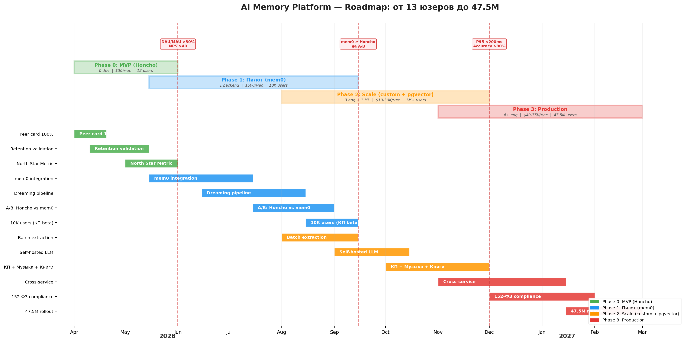

# Обзор решений для долгосрочной памяти AI-агентов

> **Для кого:** команда, которая хочет построить AI-компаньона с долгосрочной памятью на enterprise-масштабе
> **Цель:** как воспроизвести возможности Honcho (интерпретивная память для AI) на лицензионно-чистом стеке, готовом к десяткам миллионов пользователей
> **Дата:** 2026-03-27 (обновлено 2026-03-30)

---

## Executive Summary

### Контекст

Honcho (Plastic Labs) — единственный open-source фреймворк, реализующий **интерпретивную память** для AI-агентов: бот не просто хранит факты, а строит модель пользователя, делает выводы, замечает паттерны и эволюцию вкусов. 6 ключевых механик: извлечение фактов (Deriver), офлайн-анализ (Dreaming), синтез паттернов (Conclusions), профиль пользователя (Peer Card), контекст перед каждым ответом (Prefetch), диалог с памятью (Dialectic Chat).

**Проблема:** Honcho распространяется под AGPL — нельзя использовать в коммерческом enterprise-продукте без отдельного соглашения. Нужно построить аналог на лицензионно-чистых компонентах (Apache 2.0 / MIT), готовый к масштабу 50M+ пользователей.

### Вердикт

**Готового решения на рынке нет.** Мы проанализировали 20+ платформ для AI-памяти. Ни одна не реализует все 6 механизмов Honcho. Лучшие покрывают 2-4 из 6. Остальное — custom-разработка.

**Рекомендация: mem0 как основа + custom orchestrator поверх.**

- **mem0** (Apache 2.0, 25K+ stars) — лучший баланс extraction + dedup + vector search. Покрывает 2/6 механик нативно.
- **Оставшиеся 4 механики** (Dreaming, Peer Card, Prefetch, Dialectic) — строить самим. Это ~70% работы, но именно они создают продуктовую ценность.
- **Graphiti убран** после deep dive: не production-ready (12 сек/episode, баги), temporal tracking решается проще (Dreaming + metadata).
- **Storage: pgvector + Postgres** — single store вместо vector DB + graph DB. Проще, надёжнее, масштабируется через managed Postgres.

### Ключевые выводы

- **Honcho = blueprint, не зависимость.** Его архитектура — лучший референс для проектирования. Но использовать его код нельзя (AGPL).
- **mem0 = extraction engine.** Берём ядро (извлечение фактов + дедупликация), строим своё поверх.
- **70% работы — orchestrator.** Dreaming pipeline, Peer Card aggregation, Prefetch assembly, Dialectic agent — всё custom. Ни один фреймворк это не даёт.
- **Не все 6 механик нужны сразу.** Для первого релиза достаточно 3: Extraction + Peer Card + Prefetch. Dreaming и Dialectic — Phase 2.
- **Self-hosted LLM обязателен на масштабе.** API-based extraction при 5M msg/day = $29K/мес. Self-hosted (Qwen3-8B на GPU) снижает до $15K/мес с неограниченным throughput.
- **Тренд в сообществе:** минимализм побеждает фреймворки. Разработчики строят память из простых компонентов (skill.md + memory.md), а не берут платформы.

### Что строить: mapping Honcho → enterprise-стек

| Механика Honcho | Что делает | Enterprise-замена | Сложность |
|----------------|-----------|-------------------|-----------|
| **Deriver** | Извлечение фактов из сообщений | mem0.add() — extraction + dedup | Готово (mem0) |
| **Peer Card** | Гарантированный профиль юзера | Redis cache + aggregation job (top-N facts by frequency) | 2-3 нед |
| **Prefetch** | Контекст перед каждым LLM-ответом | pgvector search + Redis card → system prompt injection | 2-3 нед |
| **Dreaming** | Офлайн-анализ: паттерны, сдвиги вкусов | Cron → mem0 facts + metadata → LLM reasoning → conclusions | 3-4 нед |
| **Conclusions** | Дедуктивные/индуктивные выводы | Типизированные записи в mem0 с `{type, confidence}` | 1-2 нед |
| **Dialectic Chat** | "Расскажи что знаешь о юзере" | ReAct agent с tools: pgvector.search, get_peer_card | 2-3 нед |

**Итого на полный аналог: ~3-4 месяца, команда 2-3 backend + 1 ML engineer.**

---

## Критерии оценки

| Критерий | Вес | Описание |
|----------|-----|----------|
| Лицензия | **Блокер** | Должна позволять коммерческое использование в enterprise-продукте (Apache 2.0, MIT, BSD). AGPL и проприетарные — отсев |
| Механики Honcho | Высокий | Покрытие 6 механизмов: Deriver, Dreaming, Conclusions, Peer Card, Prefetch, Dialectic |
| Масштабируемость | Высокий | Путь до 50M юзеров: шардирование, батчинг, очереди, кэширование |
| Production readiness | Средний | Реальные деплои, бенчмарки, community, активность разработки |
| LLM flexibility | Средний | Поддержка кастомных/self-hosted моделей (self-hosted LLM) |

---

## Сводная таблица: все решения

### Tier 1 — серьёзные кандидаты

| Решение | Лицензия | Архитектура | Honcho покрытие | Масштаб | Stars | Статус |
|---------|----------|-------------|-----------------|---------|-------|--------|
| **[mem0](https://github.com/mem0ai/mem0)** | Apache 2.0 | Vector + Graph (hybrid) | 2/6 нативно | Backend-dependent | 25K+ | Production |
| **[Graphiti](https://github.com/getzep/graphiti)** | Apache 2.0 | Temporal knowledge graph | 3/6 нативно | Neo4j clustering | 14K+ | Production (с оговорками) |
| **[Cognee](https://github.com/topoteretes/cognee)** | Apache 2.0 | Graph + Vector + Reasoning | 3/6 нативно | 1M pipelines/month | — | Production (70+ enterprise) |
| **[Letta](https://github.com/letta-ai/letta)** | Apache 2.0 | Agent runtime + memory blocks | 2/6 (другая парадигма) | PG + pgvector, K8s | 16K+ | Production |
| **[Hindsight](https://github.com/vectorize-io/hindsight)** | MIT | 4 logical networks (hybrid) | 3/6 нативно | — | — | Новый, лучший бенчмарк |

### Tier 2 — нишевые или менее зрелые

| Решение | Лицензия | Архитектура | Фишка | Stars | Статус |
|---------|----------|-------------|-------|-------|--------|
| **[LangMem](https://github.com/langchain-ai/langmem)** | MIT | Semantic + Episodic + Procedural | LangChain экосистема | — | Active |
| **[SimpleMem](https://github.com/aiming-lab/SimpleMem)** | Open Source | Semantic compression + KG | 14x быстрее mem0, 30x сжатие токенов | — | Active (research) |
| **[Memori](https://github.com/MemoriLabs/Memori)** | Open Source | SQL-native (SQLite → PG → Mongo) | 67% меньше промпты чем Zep, 20x дешевле | — | Active + Cloud |
| **[Remembra](https://github.com/remembra-ai/remembra)** | Open Source | Qdrant + Graph + SQLite | Self-host за минуты, entity resolution, TTL | — | Active |
| **[MemOS](https://github.com/MemTensor/MemOS)** | Apache 2.0 | Hybrid vector + semantic | Zero cloud dependency, local SQLite | — | Active (v2.0) |
| **[memU](https://github.com/NevaMind-AI/memU)** | Open Source | Hybrid retrieval | 92% LoCoMo, enterprise-ready | — | Active |
| **[memsearch](https://github.com/zilliztech/memsearch)** | Open Source | Milvus + BM25 + markdown | Human-readable markdown as truth | — | Active (Zilliz) |
| **[Neo4j Agent Memory](https://github.com/neo4j-labs/agent-memory)** | Open Source | Knowledge graph (Neo4j native) | Официальный Neo4j Labs проект | — | Active |

### Tier 3 — не подходят (лицензия или модель)

| Решение | Лицензия | Причина отсева |
|---------|----------|---------------|
| **[Honcho](https://github.com/plastic-labs/honcho)** | AGPL-3.0 | Copyleft — требует раскрытия исходников |
| **[Remembrall](https://github.com/reductoai/remembrall)** | AGPL | Copyleft |
| **[SuperMemory](https://supermemory.ai/)** | Proprietary | API-only, нельзя self-host |
| **[Littlebird](https://littlebird.ai/)** | Commercial | Проприетарный, screen capture |
| **Zep Community Edition** | Apache 2.0 | **Deprecated** (апрель 2025), заменён Graphiti |

---

## Детальный анализ Tier 1

### mem0

**Что это:** Слой памяти для LLM с гибридным хранилищем (vector + graph). Двухфазный пайплайн: extraction → dedup (ADD/UPDATE/DELETE/NOOP).

**Механики Honcho:**

| Механизм | Покрытие | Детали |
|----------|----------|--------|
| Deriver | **Нативно** | `m.add()` — core функция |
| Dreaming | Нет | Нет фоновой обработки |
| Conclusions | Частично | Факты без типизации и confidence |
| Peer Card | Нет | Нет гарантированного контекста |
| Prefetch | Частично | `m.search()` без суммаризации |
| Dialectic | Нет | Нет reasoning агента |

**Масштабирование:**
- 23+ vector backends (Qdrant, Pinecone, pgvector, Milvus...)
- 6 graph backends (Neo4j, Memgraph, Neptune, Kuzu, AGE)
- Нет batch API в OSS (Issue #3761)
- Нет шардирования — делегировано бэкендам
- AsyncMemory для конкурентности

**Бенчмарки:** 66.9% LOCOMO, p95 1.44s, 90% экономия токенов

**LLM:** 16+ провайдеров (OpenAI, Anthropic, Gemini, Groq, Ollama, LiteLLM, vLLM)

**Вердикт:** Лучший стартовый движок. Быстро поднимается, хорошее extraction/dedup. Но на scale — становится одним из компонентов, не платформой.

> Подробный анализ: [03-mem0-feasibility-analysis.md](./03-mem0-feasibility-analysis.md)

---

### Graphiti (Zep)

**Что это:** Temporal knowledge graph для AI-агентов. Трёхуровневая иерархия подграфов: Episodes → Semantic Entities → Communities.

**Ключевая фишка — bi-temporal tracking:**
- Timeline T (когда событие произошло) + Timeline T' (когда данные попали в систему)
- `t_valid` / `t_invalid` маркеры на каждом ребре графа
- Противоречия не удаляются — инвалидируются с timestamp
- Point-in-time запросы: «что было правдой на дату X?»

**Механики Honcho:**

| Механизм | Покрытие | Детали |
|----------|----------|--------|
| Deriver | **Нативно** | `add_episode()` с entity extraction |
| Dreaming | Частично | Community detection + summarization, но не reasoning |
| Conclusions | Частично | Факты с temporal metadata, но без типизации |
| Peer Card | Нет | Нет агрегированного профиля |
| Prefetch | **Нативно** | Hybrid search (semantic + keyword + graph traversal) |
| Dialectic | Частично | Graph traversal + temporal inference, но не ReAct |

**Масштабирование:**
- Neo4j Enterprise clustering (core-replica architecture, Raft consensus)
- FalkorDB — 496x быстрее p99 чем Neo4j, 6x эффективнее по памяти
- Real-time incremental updates (без batch recomputation)
- Production caveat: прямое использование в async frameworks — проблемы; рекомендуют API-обёртку

**Бенчмарки:** Zep 94.8% Deep Memory Retrieval

**LLM:** OpenAI/Gemini (structured output), Claude/Groq/Ollama (с ограничениями — нужен OpenAI для embeddings)

**Вердикт:** Лучший выбор если важна временная эволюция фактов и разрешение противоречий. Уникальная фича на рынке. Но привязка к graph DB и ограничения по LLM providers.

---

### Cognee

**Что это:** AI memory engine с graph + vector + reasoning слоями. €7.5M seed от Pebblebed (основатели из OpenAI и FAIR).

**Механики Honcho:**

| Механизм | Покрытие | Детали |
|----------|----------|--------|
| Deriver | **Нативно** | Knowledge graph synthesis из данных |
| Dreaming | Частично | Graph embeddings + temporal reasoning |
| Conclusions | Частично | Факты в графе, но без explicit типизации |
| Peer Card | Нет | Нужен кастомный reasoning layer |
| Prefetch | **Нативно** | Graph queries + lexical retrieval |
| Dialectic | Частично | Graph traversal + embedding similarity |

**Масштабирование:**
- 1M+ pipelines/month в проде (70+ enterprise клиентов: Bayer, dltHub)
- Autoscaling + parallel graph operations
- Kubernetes-ready
- GDPR-compliant, air-gapped deployment
- Polyglot persistence: SQLite + LanceDB + Kuzu (defaults) → PG + Qdrant + Neo4j (prod)

**LLM:** Model-agnostic (любой через API)

**Вердикт:** Самый production-ready из graph-based решений. Хороший enterprise track record. Но сложный стек (3 бэкенда) и менее прозрачная архитектура.

---

### Letta (ex-MemGPT)

**Что это:** Полный agent runtime, не просто memory layer. Парадигма «LLM-as-Operating-System»: агент сам управляет своей памятью через тулы.

**Архитектура памяти — 3 уровня:**
- **Core Memory** (RAM) — малые блоки в контексте, агент читает/пишет напрямую
- **Recall Memory** (кэш) — поиск по истории разговоров
- **Archival Memory** (холодное хранилище) — vector search по документам и фактам

**Механики Honcho:**

| Механизм | Покрытие | Детали |
|----------|----------|--------|
| Deriver | Другая парадигма | Агент сам решает что запомнить (agent-driven, не pipeline) |
| Dreaming | Нет | Нет фоновой обработки |
| Conclusions | Нет | Нет типизации фактов |
| Peer Card | Частично | Core memory blocks ≈ peer card |
| Prefetch | **Нативно** | Трёхуровневая сборка контекста |
| Dialectic | Частично | Агент ищет в archival/recall через tool calls |

**Масштабирование:**
- PostgreSQL + pgvector (primary), Aurora PostgreSQL (production)
- Kubernetes с configurable workers
- Background execution mode (survive disconnects)
- До 15 read replicas для memory retrieval

**Бенчмарки:** Нет прямых на LOCOMO/LongMemEval

**LLM:** OpenAI, Anthropic, Gemini, Ollama, OpenAI-compatible endpoints

**Вердикт:** Другая философия — agent runtime, а не memory layer. Если нужен полный stateful агент — хороший выбор. Для «библиотеки памяти поверх существующего бота» — overkill.

---

### Hindsight

**Что это:** Новейшая open-source система памяти с **91.4% на LongMemEval** — лучший результат на рынке. 4 логических сети + 3 операции.

**Архитектура — 4 сети:**
- **Facts** — атомарные факты о юзере
- **Experiences** — эпизодическая память (события)
- **Entity Summaries** — агрегированные описания сущностей
- **Beliefs** — выводы и убеждения (≈ Conclusions)

**3 операции:** retain (запомнить), recall (вспомнить), reflect (обдумать)

**Механики Honcho:**

| Механизм | Покрытие | Детали |
|----------|----------|--------|
| Deriver | **Нативно** | retain operation |
| Dreaming | **Частично** | reflect operation (обдумывание) |
| Conclusions | **Нативно** | Beliefs network с типизацией |
| Peer Card | Нет | Нет агрегированного профиля |
| Prefetch | **Нативно** | recall с hybrid retrieval |
| Dialectic | Частично | reflect + recall комбинация |

**Масштабирование:** Мало данных (проект новый). Тестирован на 1.5M токенов разговоров.

**LLM:** Не указано явно, но MIT лицензия подразумевает гибкость.

**Вердикт:** Самый близкий к механикам Honcho по духу (reflect ≈ dreaming, beliefs ≈ conclusions). Но молодой проект, нет production deployments. Стоит наблюдать.

---

## Новые интересные подходы

### SimpleMem — semantic compression

**14x быстрее mem0**, 30-кратное сжатие токенов. Три стадии: structured compression → online synthesis → intent-aware retrieval. Cross-session memory (февраль 2026). Если подтвердится — потенциальный game-changer для scale.

### Memori — SQL-native

67% меньше промпты чем Zep, 20x дешевле full-context. SQL-native (SQLite → PG → MongoDB) — вписывается в любой стек без exotic DB. Memori Cloud запущен март 2026.

### memsearch (Zilliz) — markdown-first

Markdown как source of truth (human-readable). Hybrid search: dense vectors (Milvus) + BM25 + RRF reranking. Подход: «если человек не может прочитать память — что-то не так».

---

## Покрытие механизмов Honcho: сводная матрица

| Механизм | mem0 | Graphiti | Cognee | Letta | Hindsight | LangMem |
|----------|------|---------|--------|-------|-----------|---------|
| **Deriver** (extraction) | **Full** | **Full** | **Full** | Agent-driven | **Full** | **Full** |
| **Dreaming** (background) | No | Partial | Partial | No | **Partial** (reflect) | No |
| **Conclusions** (typed) | Partial | Partial | Partial | No | **Full** (beliefs) | Partial |
| **Peer Card** (guaranteed) | No | No | No | Partial | No | No |
| **Prefetch** (assembly) | Partial | **Full** | **Full** | **Full** | **Full** | Partial |
| **Dialectic** (reasoning) | No | Partial | Partial | Partial | Partial | No |
| **Итого** | 2/6 | 3/6 | 3/6 | 2/6 | 3.5/6 | 1.5/6 |

**Вывод:** ни одно решение не покрывает > 60% механизмов Honcho. Peer Card и полноценный Dreaming нужно строить самим в любом случае.

---

## Масштабируемость: сводная матрица

| Аспект | mem0 | Graphiti | Cognee | Letta | Hindsight |
|--------|------|---------|--------|-------|-----------|
| Шардирование | Через бэкенд | Neo4j clustering | K8s autoscale | Aurora PG | ? |
| Batch API | Нет (OSS) | Нет | Да | Нет | ? |
| Очереди | Нет | Нет | Нет | Нет | Нет |
| Кэширование | Нет | Нет | Да (tuned) | PG replicas | Нет |
| Async | Да | Да (с caveats) | Да | Да | ? |
| Tested at scale | Бенчмарки | Zep Cloud | 1M/month prod | AWS case study | 1.5M tokens |

**Вывод:** для enterprise-scale (50M+) все решения требуют кастомной обвязки: Kafka, шардирование, кэш, rate limiting. Разница — в том сколько обвязки нужно.

---

## Бенчмарки

| Решение | LongMemEval | LoCoMo | Deep Memory | Метод |
|---------|-------------|--------|-------------|-------|
| **Hindsight** | **91.4%** | — | — | 4 logical networks |
| **Zep/Graphiti** | — | — | **94.8%** | Temporal KG |
| **Honcho** | — | **89.9%** | — | Formal logic |
| **memU** | — | **92%** | — | Hybrid retrieval |
| **mem0** | — | **66.9%** | — | Vector + graph |
| **SimpleMem** | — | +26.4% F1 | — | Semantic compression |
| **Memori** | — | — | — | 67% меньше промпты чем Zep |

---

## Лицензии: полная сводка

| Решение | Лицензия | Коммерческое использование | Self-host |
|---------|----------|---------------------------|-----------|
| mem0 | Apache 2.0 | **Да** | Да |
| Graphiti | Apache 2.0 | **Да** | Да |
| Cognee | Apache 2.0 | **Да** | Да |
| Letta | Apache 2.0 | **Да** | Да |
| Hindsight | MIT | **Да** | Да |
| LangMem | MIT | **Да** | Да |
| SimpleMem | Open Source | **Да** | Да |
| Memori | Open Source | **Да** | Да + Cloud |
| MemOS | Apache 2.0 | **Да** | Да |
| Remembra | Open Source | **Да** | Да |
| memsearch | Open Source | **Да** | Да |
| Motorhead | MIT | **Да** | Да |
| Honcho | **AGPL-3.0** | **Нет** (без соглашения) | Да, но copyleft |
| Remembrall | **AGPL** | **Нет** (без соглашения) | Да, но copyleft |
| SuperMemory | Proprietary | **Нет** (API-only) | Нет |
| Littlebird | Commercial | **Нет** | Нет |

---

## Рекомендация

### Оптимальный стек

```
mem0 (extraction + dedup + search)
  + Graphiti (temporal facts, contradiction resolution)  -- опционально
  + Кастомная обвязка:
      - Kafka + воркеры (Deriver pipeline)
      - Dreaming pipeline (cron → reasoning → update)
      - Peer Card (агрегация → Redis кэш)
      - Prefetch обёртка (card + search + summary)
      - Dialectic (ReAct агент)
```

### Альтернативный стек (минимум зависимостей)

```
Своя реализация extraction (~100 строк)
  + pgvector (vectors) + Apache AGE (graph) -- всё в PostgreSQL
  + Та же кастомная обвязка
  -- Проще, полный контроль, нет vendor dependency
  -- Но больше кода на старте
```

### Что наблюдать

- **Hindsight** — если подтвердит production readiness, может стать лидером (91.4% + MIT + reflect operation)
- **SimpleMem** — 14x быстрее mem0 при лучшем качестве; если выйдет из research стадии — серьёзный кандидат
- **Memori** — SQL-native подход может быть самым простым для интеграции в стек крупного сервиса

---

## Community Insights: русскоязычные AI/Agent-чаты

> **Источник:** поиск по 64 сообщениям из 6 Telegram-чатов (март 2026): «Пилим агентов», «вайбкодеры», «LLM под капотом», «AI Masters», «джипититоры», «n8n чат».

### Подходы к памяти, обсуждаемые в сообществе

Русскоязычное AI-сообщество активно экспериментирует с памятью для агентов. Основные паттерны:

1. **Sliding window + summarization + long-term storage** — самый популярный подход. Комбинация: короткое окно контекста + суммаризация старых сообщений + долгосрочное хранилище фактов. Обсуждается в нескольких чатах как «базовый минимум».

2. **Zettelkasten-подход** (Сергей, «Пилим агентов») — суб-агент для памяти, организующий знания как сеть связанных заметок. По сути — граф знаний, реализованный через паттерн Zettelkasten. Концептуально близко к Graphiti, но проще и без temporal tracking.

3. **skill.md + memory.md** (Виталий Иванин, «джипититоры») — минимальная архитектура: сервер хранит два файла на юзера: описание навыков бота и память о юзере. Подаёт в любой LLM API. «Просто вайб-кодь сервер» — самый прагматичный подход в выборке.

4. **md-файлы как артефакты между сессиями** («AI Masters») — пользователи Claude Projects описывают паттерн: LLM генерирует markdown-саммари сессии, который подаётся как контекст в следующую. Фактически — ручной Peer Card.

5. **Supabase + RAG** («n8n чат») — Supabase как vector store + RAG для извлечения релевантных воспоминаний. Проблема: memory node в n8n не сохраняет предыдущий контекст корректно.

6. **Agent changelog** («LLM под капотом») — паттерн «лог изменений агента»: агент ведёт журнал своих обновлений (что узнал, что изменилось). По сути — Dreaming lite.

### Альтернативные паттерны

| Паттерн | Откуда | Аналог в нашем стеке | Сложность |
|---------|--------|----------------------|-----------|
| Zettelkasten (граф заметок) | «Пилим агентов» | Graphiti (упрощённый) | Средняя |
| skill.md + memory.md | «джипититоры» | Peer Card + system prompt | Минимальная |
| md-саммари между сессиями | «AI Masters» | Peer Card (ручной) | Минимальная |
| Supabase + RAG | «n8n чат» | pgvector + extraction | Средняя |
| Auto-dream (Claude Code) | «вайбкодеры» | Dreaming pipeline | Средняя |
| Agent changelog | «LLM под капотом» | Dreaming lite | Низкая |

### Реальные use cases

- **Персонализация тренировок** (Андрей, «вайбкодеры») — адаптивный бот, который парсит тренировочные сайты и персонализирует программу через память для каждого юзера. Подтверждает гипотезу: память = персонализация = ценность.
- **Auto-dream в Claude Code** — обсуждение механизма cleanup/dedup/contradiction resolution для памяти Claude Code. По сути — тот же Dreaming, но для IDE-контекста.
- **Memento-Skills** (paper, «LLM под капотом») — «Let Agents Design Agents» с эволюционирующими скиллами. Память не про факты о юзере, а про навыки самого агента.

### Инструменты и инфраструктура

- **Google Embedding 2** — рекомендуется для эмбеддингов (упоминание в «вайбкодерах»)
- **Zilliz Cloud + Milvus** — рекомендуется для RAG, бесплатные тиры («LLM под капотом»). Совпадает с нашим упоминанием memsearch от Zilliz.
- **CLI tools как memory backend** — использование CLI-утилит для управления памятью агентов

### Валидация наших рекомендаций

**Что подтверждается:**

1. **Нет готового решения** — сообщество массово строит кастомные системы. Никто не упоминает «взял X и всё заработало». Это валидирует наш вывод: готового решения на рынке нет.
2. **md-файлы = жизнеспособный MVP** — паттерн skill.md + memory.md из «джипититоров» и md-саммари из «AI Masters» подтверждают: для MVP достаточно markdown-файлов с фактами о юзере. Наш Phase 0 (Honcho) — это по сути тот же паттерн, но структурированный.
3. **Dreaming нужен** — обсуждение auto-dream и agent changelog подтверждает: фоновая обработка памяти (dedup, cleanup, выводы) — реальная потребность, а не теоретическая.
4. **pgvector / Supabase как стандарт** — community сходится на PostgreSQL + vectors как основе. Совпадает с нашей рекомендацией для Phase 2.

**Что оспаривается / дополняется:**

1. **Минимализм > фреймворки** — сообщество тяготеет к «просто md-файлы + API», а не к mem0/Graphiti/Cognee. Возможно, для Phase 1 стоит рассмотреть ещё более простой путь: custom extraction → PostgreSQL JSON → md-файл как Peer Card.
2. **Владимир спросил про Honcho 17 марта** — в чате «джипититоры» владелец проекта интересовался Honcho. Это означает, что Honcho на радаре русскоязычного AI-сообщества, но пока не стал стандартом.
3. **Память агента ≠ память о юзере** — Memento-Skills и agent changelog показывают другой угол: память не только «что мы знаем о юзере», но и «что агент умеет и как менялся». Наша архитектура фокусируется на первом; стоит учесть второе.

### Ключевой вывод

Русскоязычное AI-сообщество (март 2026) находится на стадии «каждый строит своё». Преобладают минималистичные подходы: markdown-файлы, простые key-value хранилища, ручные саммари. Фреймворки уровня mem0/Graphiti практически не упоминаются — либо не знают, либо сознательно выбирают простоту. Это подтверждает стратегию «начать с Honcho, мигрировать на custom» — community ещё не дозрело до стандартного решения, и ставка на один фреймворк рискованна.

---

## Ссылки

- [mem0 GitHub](https://github.com/mem0ai/mem0) | [Docs](https://docs.mem0.ai/) | [Paper](https://arxiv.org/abs/2504.19413)
- [Graphiti GitHub](https://github.com/getzep/graphiti) | [Docs](https://help.getzep.com/graphiti) | [Paper](https://arxiv.org/abs/2501.13956)
- [Cognee GitHub](https://github.com/topoteretes/cognee) | [Site](https://www.cognee.ai/)
- [Letta GitHub](https://github.com/letta-ai/letta) | [Docs](https://docs.letta.com) | [MemGPT Paper](https://arxiv.org/abs/2310.08560)
- [Hindsight GitHub](https://github.com/vectorize-io/hindsight) | [VentureBeat](https://venturebeat.com/data/with-91-accuracy-open-source-hindsight-agentic-memory-provides-20-20-vision/)
- [LangMem GitHub](https://github.com/langchain-ai/langmem) | [Blog](https://blog.langchain.com/langmem-sdk-launch/)
- [SimpleMem Paper](https://arxiv.org/abs/2601.02553) | [GitHub](https://github.com/aiming-lab/SimpleMem)
- [Memori GitHub](https://github.com/MemoriLabs/Memori) | [InfoQ](https://www.infoq.com/news/2025/12/memori/)
- [Remembra GitHub](https://github.com/remembra-ai/remembra) | [Site](https://remembra.dev/)
- [MemOS GitHub](https://github.com/MemTensor/MemOS)
- [memsearch GitHub](https://github.com/zilliztech/memsearch)
- [Neo4j Agent Memory](https://github.com/neo4j-labs/agent-memory)
- [Honcho GitHub](https://github.com/plastic-labs/honcho) | [Benchmarks](https://blog.plasticlabs.ai/research/Benchmarking-Honcho)
- [AI Memory Survey (arxiv)](https://arxiv.org/abs/2512.13564)
- [Benchmark: 5 Memory Systems Compared](https://dev.to/varun_pratapbhardwaj_b13/5-ai-agent-memory-systems-compared-mem0-zep-letta-supermemory-superlocalmemory-2026-benchmark-59p3)
- [Letta Forum: Memory Comparison](https://forum.letta.com/t/agent-memory-letta-vs-mem0-vs-zep-vs-cognee/88)

---

## Decision Matrix: Топ-5 решений

Weighted scoring для конкретного выбора. Масштаб оценки: 1-10 (10 = лучший).

### Критерии и веса

| Критерий | Вес | Обоснование |
|----------|-----|-------------|
| Механики Honcho (6 из 6) | 30% | Peer Card, Dreaming, Conclusions, Prefetch, Dialectic — core для персонализации |
| Лицензия (Apache/MIT) | 20% | Блокер для enterprise. AGPL = отдельное соглашение |
| Production readiness | 20% | Реальные деплои, community, стабильность API |
| Масштабируемость (>1M users) | 15% | Шардирование, батчинг, кэш |
| LLM flexibility | 15% | Self-hosted модели, custom pipelines |

### Scoring

| Решение | Механики (30%) | Лицензия (20%) | Production (20%) | Масштаб (15%) | LLM flex (15%) | **Total** |
|---------|---------------|----------------|-------------------|---------------|----------------|-----------|
| **Honcho** | 10 (3.0) | 3 (0.6) | 7 (1.4) | 4 (0.6) | 6 (0.9) | **6.5** |
| **mem0** | 4 (1.2) | 10 (2.0) | 9 (1.8) | 7 (1.05) | 9 (1.35) | **7.4** |
| **Graphiti** | 6 (1.8) | 10 (2.0) | 6 (1.2) | 5 (0.75) | 7 (1.05) | **6.8** |
| **Cognee** | 5 (1.5) | 10 (2.0) | 7 (1.4) | 7 (1.05) | 8 (1.2) | **7.15** |
| **Letta** | 4 (1.2) | 10 (2.0) | 8 (1.6) | 6 (0.9) | 7 (1.05) | **6.75** |

### Результат

**mem0 (7.4)** лидирует по совокупности — лучший баланс лицензии, production readiness и LLM flexibility. Проигрывает Honcho только по нативным механикам (4/10 vs 10/10).

**Honcho (6.5)** — лучший по механикам, но AGPL (3/10 лицензия) и слабая масштабируемость (4/10) тянут вниз.

### Sensitivity Analysis

Если вес "Механики Honcho" поднять до 50% (для проекта где персонализация = core):

| Решение | Score (30% механики) | Score (50% механики) | Δ |
|---------|---------------------|---------------------|---|
| Honcho | 6.5 | **7.5** ← winner | +1.0 |
| mem0 | 7.4 | 6.6 | -0.8 |

**Вывод:** при текущих приоритетах (персонализация > лицензия) Honcho выигрывает. При enterprise-приоритетах (лицензия > механики) — mem0.

### Рекомендация по стадиям

| Стадия | Юзеров | Решение | Почему |
|--------|--------|---------|--------|
| MVP / прототип | 1-1K | **Honcho** | 6/6 механик из коробки, быстрый старт |
| Рост | 1K-100K | **mem0 + soft temporal metadata** | mem0 для extraction/dedup, temporal через metadata (created_at, previous_value), без отдельного graph DB |
| Enterprise | 100K+ | **Custom extraction + pgvector + Postgres** | Batch extraction (каждые 5-10 сообщений вместо каждого), single store, self-hosted LLM |

### Почему без Graphiti (обновление после deep dive)

Первоначальная рекомендация включала Graphiti как temporal knowledge graph. После детального анализа (production bugs, cost, necessity) Graphiti **убран** из рекомендации:

1. **Не production-ready**: 12 сек/episode (6-10 LLM вызовов), баги с null UUIDs, дубликатами entities, async worker failures. Docker образ отставал на 12 версий.
2. **Temporal tracking не нужен компаньону**: "юзер раньше любил хорроры → теперь комедии" уже ловится Dreaming pipeline как conclusion. Ни один юзер не спросит "что ты знал обо мне 5 марта?".
3. **Zep убил Community Edition**: Graphiti — воронка в Zep Cloud ($25/мес+). OSS получает "good enough" поддержку.
4. **1.68x token cost**: каждое сообщение = двойная extraction (mem0 + Graphiti). При 5M msg/day это +$15K/мес за решение проблемы, которой нет.
5. **Jean Memory (mem0+Graphiti) мёртв**: 14 месяцев без коммитов, "Graphiti integration" = маркетинг.

**Замена**: soft temporal metadata в mem0 (`created_at`, `updated_at`, `previous_value` в metadata каждого memory) + Dreaming pipeline для detection of preference shifts. 80% temporal value при 10% complexity.

---

## Next Steps: от прототипа к продукту

### Где мы сейчас

Работающий прототип: nanobot + Honcho. 13 юзеров, Telegram. Honcho даёт 6/6 механик памяти из коробки (Deriver, Dreaming, Conclusions, Peer Card, Prefetch, Dialectic Chat). Бот персонализирует тон, помнит вкусы между сессиями, проактивно пишет юзерам.

### Целевой масштаб

| Сервис | MAU | Подписчики | Источник |
|--------|-----|------------|---------|
| Подписка (стриминговая платформа) | — | 47.5M (Q4 2025) | [Enterprise ФинОтчёт](https://example.com/financial-report) |
| Видеостриминг | 60M | 18M (стриминг) | [AdIndex](https://adindex.ru/news/digital/2025/12/17/341055.phtml) |
| Музыкальный стриминг | 30.5M | 24M | [Sostav](https://www.sostav.ru/publication/auditoriya-yandeks-muzyki-prevysila-30-5-mln-chelovek-v-mesyats-79308.html) |
| Книжный стриминг | 5.2M/мес | — | [CNews](https://www.cnews.ru/news/line/2025-07-28_52_mln_podpischikov_yandeks) |

**Target:** 47.5M подписчиков стриминговой платформы = потенциальная аудитория AI-компаньона. Реалистичный DAU: 5-10% = 2.5-5M ежедневных пользователей.

### Нагрузка: расчёт

| Параметр | Прототип (сейчас) | Пилот (6 мес) | Production (12 мес) |
|----------|-------------------|---------------|---------------------|
| Юзеров | 13 | 10K | 1M+ |
| Сообщений/день | 50 | 50K | 5M |
| Memory writes/день | 50 | 50K | 5M |
| Memory reads/день (prefetch) | 50 | 50K | 5M |
| Dreaming jobs/день | 13 | 10K | 1M |
| Peer Card updates/день | ~5 | 5K | 500K |
| **Input tokens/день** | **1.75M** | **1.75B** | **175B** |

### Roadmap: от прототипа к enterprise

```
ДОКАЗАТЬ           ПОСТРОИТЬ              МАСШТАБИРОВАТЬ         РАСКАТИТЬ
ЦЕННОСТЬ           СВОЁ                   НА МИЛЛИОНЫ            НА ВСЮ БАЗУ

Phase 0             Phase 1                Phase 2                Phase 3
0-2 мес             2-6 мес                6-12 мес               12+ мес

Honcho (as-is)  →   mem0 + Postgres    →   Custom + pgvector  →   Memory Platform
0 dev               1 backend              3 eng + 1 ML           6+ eng
$30/мес             $500/мес               $10-30K/мес            $40-75K/мес

"Память нужна?"     "Какие механики?"      "1M без деградации?"   "Δ churn >15%?"
```

#### Phase 0: Доказать ценность

**Вопрос:** Хочет ли юзер общаться с AI-компаньоном, который помнит его вкусы?

Не строим инфру. Используем Honcho as-is. Фокус — продуктовая валидация: работает ли персонализация через память? Стоит ли вообще идти в эту сторону?

**Gate → Phase 1:** retention >30% DAU/MAU, NPS >40, качественная обратная связь (5+ интервью)

#### Phase 1: Построить своё

**Вопрос:** Какие из 6 механик памяти реально двигают engagement? Работает ли за пределами тестовой группы?

Замена Honcho (AGPL-блокер) на лицензионно-чистый стек. Не строим все 6 механик — начинаем с 3: Extraction + Peer Card + Prefetch. A/B тест: память ON vs OFF. Пилот на 10K реальных юзеров.

**Gate → Phase 2:** W4 retention >20%, доказанный Δ retention память ON vs OFF

#### Phase 2: Масштабировать

**Вопрос:** Может ли система обслужить 1M+ юзеров без деградации качества и по приемлемой экономике?

Batch extraction (per-message LLM вызовы при 5M msg/day = $29K/мес — нужен batch). Dreaming pipeline (офлайн-анализ паттернов). Интеграция с данными стриминговых сервисов (видео, музыка, книги) для cold start. Self-hosted LLM.

**Gate → Phase 3:** prefetch P95 <200ms, 1M+ users, cost/user <$0.01/мес

#### Phase 3: Раскатить

**Вопрос:** Увеличивает ли AI-компаньон retention подписки?

Массовый rollout на всю базу подписчиков. Cross-service персонализация ("смотрел X → зайдёт Y в другом сервисе"). 152-ФЗ compliance. Бизнес-метрика: Δ churn подписки стриминга >15%.

### Принципы

1. **Каждая фаза — один вопрос.** Не "построим инфру", а "память влияет на retention?"
2. **Gate — продуктовая метрика.** Retention и churn, не "сервис поднят"
3. **Не все 6 механик сразу.** Phase 1 = 3 из 6. Dreaming — только после доказательства ценности базовой памяти
4. **Инфра следует за продуктом.** Honcho → mem0 → custom — каждый переход по продуктовой необходимости

### Ключевые риски

| Риск | Импакт | Митигация |
|------|--------|-----------|
| Память не влияет на retention | Убивает весь проект | A/B тест в Phase 1, kill decision если Δ <5% |
| Honcho AGPL блокирует Enterprise | Блокер для пилота | Self-host в Phase 1, замена на mem0 |
| LLM cost при 5M msg/day ($29K/мес на API) | Экономика не сходится | Batch processing + self-hosted LLM |
| 70% работы = custom код, не фреймворк | Медленный Phase 2 | Начинать с 3 механик, не 6 |
| Vendor LLM дороже GPT-4o-mini в 15x | Неверный выбор LLM провайдера | Benchmark до выбора, default GPT-4o-mini |

---

## Gantt: Roadmap по фазам



```
2026        Q2              Q3              Q4              2027 Q1
Apr  May  Jun  Jul  Aug  Sep  Oct  Nov  Dec  Jan  Feb  Mar
 │    │    │    │    │    │    │    │    │    │    │    │
 ├─── Phase 0: MVP (Honcho) ───┤
 │ [Retention валидация]  0 dev │
 │ [Peer card 100%]            │
 │ [North Star Metric]         │
 │                              │
 │         ├──── Phase 1: Пилот (mem0) ────────┤
 │         │ [mem0 интеграция]    1 backend     │
 │         │ [Dreaming pipeline]                │
 │         │ [Peer Card на pgvector]            │
 │         │ [A/B: Honcho vs mem0]              │
 │         │ [10K юзеров Видеостриминг]             │
 │         │                                    │
 │         │              ├──── Phase 2: Scale (custom) ──────────┤
 │         │              │ [Batch extraction]    2-3 backend     │
 │         │              │ [Self-hosted LLM]                     │
 │         │              │ [Шардирование]                        │
 │         │              │ [Видеостриминг+Музыка+Книги интеграция]   │
 │         │              │ [1M+ юзеров]                          │
 │         │              │                                       │
 │         │              │                    ├── Phase 3: Prod ──
 │         │              │                    │ [47.5M users]
 │         │              │                    │ [Cross-service]
 │         │              │                    │ [152-ФЗ]
 ▼         ▼              ▼                    ▼

Ресурсы:
Phase 0:  0 backend  │ 1 PM/founder     │ Honcho SaaS (бесплатно)
Phase 1:  1 backend  │ 1 PM             │ Managed PG + Redis (~$200/мес)
Phase 2:  2-3 backend│ 1 PM, 1 ML       │ K8s + GPU ($5-15K/мес)
Phase 3:  4+ backend │ 1 PM, 2 ML, 1 SRE│ Full infra ($25-50K/мес)

Блокеры между фазами:
Phase 0→1:  retention >30% DAU/MAU, NPS >40
Phase 1→2:  mem0 quality ≥ Honcho на A/B тесте
Phase 2→3:  <200ms prefetch P95, extraction accuracy >90%
```

### Ресурсы: детальная разбивка

| Фаза | Длительность | Команда | Инфра cost/мес | LLM cost/мес | Итого/мес |
|------|-------------|---------|----------------|-------------|-----------|
| **Phase 0** | 2 мес | 0 dev (founder) | $0 (Honcho SaaS) | $30 | **$30** |
| **Phase 1** | 4 мес | 1 backend | $200 (PG+Redis) | $300 | **$500** + salary |
| **Phase 2** | 4 мес | 3 engineers | $5-15K (K8s+GPU) | $5-15K | **$10-30K** + salaries |
| **Phase 3** | ongoing | 6+ engineers | $25-50K | $15-25K (self-hosted) | **$40-75K** + salaries |

