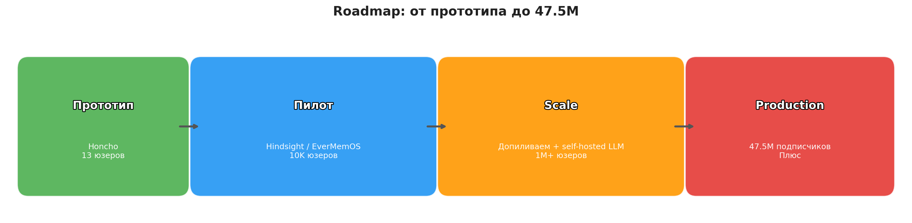

# AI Memory Platforms: Enterprise-Scale Alternative to Honcho

> Единый исследовательский отчет: 20+ платформ памяти для AI-агентов
> Дата: 2026-03-31

---

## TL;DR: Четыре кандидата на замену Honcho

| | **Hindsight** | **EverMemOS** | **Letta** | **mem0** |
|---|---|---|---|---|
| **Механики Honcho** | 9/12 | 10/12 | 9/12 | 3/12 |
| **Лицензия** | MIT | Apache 2.0 | Apache 2.0 | Apache 2.0 |
| **Инфра** | PostgreSQL only | MongoDB + ES + Milvus | PostgreSQL, K8s | 23+ vector backends |
| **Масштаб** | PG шардится стандартно, но проект молодой — на 50M не проверяли | Каждая из 3 баз шардится, но три точки отказа | K8s-деплой, Conversations API для шардинга по юзерам | Нет batch API в OSS, нет шардинга, каждый write = LLM call (20 сек) |
| **Ключевая фича** | Opinion network = Conclusions, zero-LLM retrieval | Лучший бенчмарк (93% LoCoMo), нативный Peer Card + Dreaming | Sleep-time agents = Dreaming, зрелое community ($10M, 21K stars) | Extraction + dedup, крупнейшее community (48K stars, $24M) |
| **Главный риск** | Проекту полгода, маленькая команда | Мало документации, ранний проект | Другая парадигма (agent-managed memory) | 70% логики памяти надо строить с нуля |
| **Вопрос к инфре** | Есть ли managed PG с pgvector? | Готовы держать 3 базы? | Ложится ли agent-managed memory на кейс? | Если 70% пишем сами — зачем брать mem0? |

---

## Executive Summary

### Ключевой вопрос

Как построить enterprise-scale альтернативу Honcho для персонализации AI-агентов, используя лицензионно-совместимые компоненты, с прицелом на 50M+ пользователей?

### Контекст

Honcho (Plastic Labs) — единственный open-source фреймворк, реализующий **интерпретивную память** для AI-агентов: бот не просто хранит факты, а строит модель пользователя, делает выводы, замечает паттерны и эволюцию вкусов. 6 ключевых механик: извлечение фактов (Deriver), офлайн-анализ (Dreaming), синтез паттернов (Conclusions), профиль пользователя (Peer Card), контекст перед каждым ответом (Prefetch), диалог с памятью (Dialectic Chat).

**Проблема:** Honcho распространяется под AGPL — нельзя использовать в коммерческом enterprise-продукте без отдельного соглашения. Нужно построить аналог на лицензионно-чистых компонентах (Apache 2.0 / MIT), готовый к масштабу 50M+ пользователей.

### Вердикт

**Готового решения на рынке нет.** Мы проанализировали 20+ платформ для AI-памяти. Ни одна не реализует все 6 механизмов Honcho. Лучшие покрывают 9-10 из 12 баллов (шкала 0-2 на механизм). Остальное — custom-разработка.

### Top 3 рекомендации

| # | Платформа | Обоснование |
|---|-----------|------------|
| **1** | **Hindsight** (MIT) | Лучшее покрытие механизмов Honcho (9/12). Единственная система с Opinion network (аналог Conclusions). SOTA на LongMemEval (91.4%). PostgreSQL-only инфраструктура. Fortune 500 в продакшене. |
| **2** | **EverMemOS** (Apache 2.0) | Максимальное покрытие Honcho (10/12). SOTA LoCoMo (93.05%). Нативные Deriver + Dreaming + Peer Card + Prefetch. Но: тройной бэкенд (MongoDB + ES + Milvus), молодой проект, меньше community. |
| **3** | **Letta** (Apache 2.0) | Зрелая платформа (ex-MemGPT, Berkeley BAIR). $10M funding. Sleep-time agents = Dreaming. Core memory blocks = Peer Card. Но: agent self-editing парадигма вместо structured extraction, 74% LoCoMo. |

**Стратегическое решение:** Hindsight как primary choice для enterprise-платформы. Единственный PostgreSQL-бэкенд минимизирует операционную сложность. MIT-лицензия снимает copyleft-риски. Opinion network с confidence scoring -- ближайший аналог Honcho Conclusions. Reflect operation покрывает Dreaming. Недостающие компоненты (Dialectic, structured Peer Card) реализуемы поверх API за 4-6 недель.

### Ключевые выводы

- **Honcho = blueprint, не зависимость.** Его архитектура — лучший референс для проектирования. Но использовать его код нельзя (AGPL).
- **70% работы — orchestrator.** Dreaming pipeline, Peer Card aggregation, Prefetch assembly, Dialectic agent — всё custom. Ни один фреймворк это не даёт полностью.
- **Не все 6 механик нужны сразу.** Для первого релиза достаточно 3: Extraction + Peer Card + Prefetch. Dreaming и Dialectic — Phase 2.
- **Self-hosted LLM обязателен на масштабе.** API-based extraction при 5M msg/day = $29K/мес. Self-hosted снижает до $15K/мес с неограниченным throughput.
- **Тренд в сообществе:** минимализм побеждает фреймворки. Разработчики строят память из простых компонентов, а не берут платформы.

### Что строить: mapping Honcho -> enterprise-стек

| Механика Honcho | Что делает | Enterprise-замена | Сложность |
|----------------|-----------|-------------------|-----------|
| **Deriver** | Извлечение фактов из сообщений | Hindsight Retain / mem0.add() — extraction + dedup | Готово |
| **Peer Card** | Гарантированный профиль юзера | Hindsight Mental Models + structured schema layer | 2-3 нед |
| **Prefetch** | Контекст перед каждым LLM-ответом | Hindsight Recall (4-way hybrid retrieval) | 1-2 нед |
| **Dreaming** | Офлайн-анализ: паттерны, сдвиги вкусов | Hindsight Reflect / Cara | 2-3 нед |
| **Conclusions** | Дедуктивные/индуктивные выводы | Hindsight Opinion network (confidence scoring) | 1-2 нед |
| **Dialectic Chat** | "Расскажи что знаешь о юзере" | ReAct agent поверх Recall API | 2-3 нед |

**Итого на полный аналог: ~6-8 недель (Hindsight), ~3-4 месяца (с нуля).**

---

## Критерии оценки

| Критерий | Вес | Описание |
|----------|-----|----------|
| Лицензия | **Блокер** | Должна позволять коммерческое использование в enterprise-продукте (Apache 2.0, MIT, BSD). AGPL и проприетарные — отсев |
| Механики Honcho | Высокий (30%) | Покрытие 6 механизмов: Deriver, Dreaming, Conclusions, Peer Card, Prefetch, Dialectic (шкала 0-2 на механизм, макс 12) |
| Production readiness | Средний (20%) | Реальные деплои, бенчмарки, community, активность разработки, известные баги |
| Масштабируемость | Высокий (15%) | Путь до 50M юзеров: шардирование, батчинг, очереди, кэширование |
| LLM flexibility | Средний (15%) | Поддержка кастомных/self-hosted моделей (Ollama, vLLM), количество провайдеров |

---

## Сводная таблица: все решения

### Tier 1 — серьёзные кандидаты (deep dive проведён)

| Платформа | Лицензия | Stars | Honcho Coverage (/12) | LoCoMo | Архитектура | Key Differentiator |
|-----------|---------|------:|:-----:|--------|-------------|-------------------|
| **Honcho** | AGPL-3.0 | 414 | **12** | 89.9% | PostgreSQL + pgvector | Typed conclusions + Dialectic API + Neuromancer XR |
| **EverMemOS** | Apache 2.0 | ~2,500 | **10** | **93.05%** | MongoDB + Elasticsearch + Milvus | Engram lifecycle + MemScene clustering + SOTA benchmarks |
| **Hindsight** | MIT | 6,600 | **9** | 89.61% | PostgreSQL + pgvector | Opinion network + Reflect + 4-way hybrid retrieval |
| **Letta** | Apache 2.0 | 21,600 | **9** | 74.0% | PostgreSQL + pgvector | Agent self-editing memory + sleep-time agents |
| **Memobase** | Apache 2.0 | 2,637 | **7** | 75.78% | PostgreSQL + Redis | Structured user profiles + buffer batching |
| **MS Foundry** | Proprietary | N/A | **7** | N/A | Azure Cosmos DB | Azure enterprise compliance + managed service |
| **Memori** | Apache 2.0 | 12,400 | **7** | 81.95% | SQL-native (multi-DB) | Semantic triples + typed categories + low tokens |
| **Cognee** | Apache 2.0 | 14,800 | **6** | N/A | Graph + Vector + Relational | Knowledge graph + 14 retrieval modes + Dreamify |
| **Graphiti** | Apache 2.0 | 23,000 | **5** | 58-80% | Neo4j / FalkorDB | Bi-temporal model + zero-LLM retrieval |
| **MemOS** | Apache 2.0 | 7,400 | **5** | 75.80% | SQLite / Redis | MemCube abstraction + 3 memory types |
| **Mem0** | Apache 2.0 | 48,000 | **3** | 66.9% | Vector + Graph (pluggable) | 23+ vector DB backends + largest community |
| **A-MEM** | MIT | 941 | **3** | ~45-50% | ChromaDB | Zettelkasten linking + minimal token usage |

### Tier 2 — нишевые или менее зрелые

| Решение | Лицензия | Архитектура | Фишка | Stars | Статус |
|---------|----------|-------------|-------|-------|--------|
| **LangMem** | MIT | Semantic + Episodic + Procedural | LangChain экосистема | — | Active |
| **SimpleMem** | Open Source | Semantic compression + KG | 14x быстрее mem0, 30x сжатие токенов | — | Active (research) |
| **Remembra** | Open Source | Qdrant + Graph + SQLite | Self-host за минуты, entity resolution, TTL | — | Active |
| **memU** | Open Source | Hybrid retrieval | 92% LoCoMo, enterprise-ready | — | Active |
| **memsearch** | Open Source | Milvus + BM25 + markdown | Human-readable markdown as truth | — | Active (Zilliz) |
| **Neo4j Agent Memory** | Open Source | Knowledge graph (Neo4j native) | Официальный Neo4j Labs проект | — | Active |

### Tier 3 — не подходят (лицензия или модель)

| Решение | Лицензия | Причина отсева |
|---------|----------|---------------|
| **Honcho** | AGPL-3.0 | Copyleft — требует раскрытия исходников |
| **Remembrall** | AGPL | Copyleft |
| **SuperMemory** | Proprietary | API-only, нельзя self-host |
| **Littlebird** | Commercial | Проприетарный, screen capture |
| **Zep Community Edition** | Apache 2.0 | **Deprecated** (апрель 2025), заменён Graphiti |

---

## Honcho Mechanism Coverage Matrix

Scoring: **0** = absent, **1** = partial, **2** = native

| Платформа | Deriver | Dreaming | Conclusions | Peer Card | Prefetch | Dialectic | **Total** |
|-----------|:-------:|:--------:|:-----------:|:---------:|:--------:|:---------:|:---------:|
| **Honcho** | 2 | 2 | 2 | 2 | 2 | 2 | **12** |
| **EverMemOS** | 2 | 2 | 1 | 2 | 2 | 1 | **10** |
| **Hindsight** | 2 | 2 | 2 | 1 | 2 | 0 | **9** |
| **Letta** | 1 | 2 | 1 | 2 | 2 | 1 | **9** |
| **Memobase** | 2 | 1 | 0 | 2 | 2 | 0 | **7** |
| **MS Foundry** | 2 | 1 | 0 | 2 | 2 | 0 | **7** |
| **Memori** | 2 | 0 | 1 | 1 | 2 | 1 | **7** |
| **Cognee** | 2 | 1 | 1 | 0 | 1 | 1 | **6** |
| **Graphiti** | 2 | 1 | 0 | 0 | 1 | 1 | **5** |
| **MemOS** | 2 | 1 | 0 | 0 | 2 | 0 | **5** |
| **Mem0** | 2 | 0 | 0 | 0 | 1 | 0 | **3** |
| **A-MEM** | 1 | 1 | 0 | 0 | 1 | 0 | **3** |

### Ключевые наблюдения

- **Deriver** реализован нативно почти во всех платформах (кроме A-MEM и Letta с partial)
- **Dreaming** нативно есть только у Honcho, EverMemOS и Hindsight (Reflect)
- **Conclusions** с typed reasoning -- уникальная сила Honcho; частично у Hindsight (Opinion network)
- **Peer Card** как structured profile: Honcho, EverMemOS, Letta, Memobase, MS Foundry
- **Dialectic** -- самый редкий механизм, нативно только у Honcho

**Вывод:** ни одно решение не покрывает все 6 механизмов Honcho. Peer Card и Dialectic нужно строить/дорабатывать самим в любом случае.

---

## Decision Matrix

Взвешенная оценка: Honcho Coverage 30%, License 20%, Production Readiness 20%, Scale 15%, LLM Flexibility 15%

### Шкала оценки (0-10)

- **Honcho Coverage (30%):** total/12 * 10
- **License (20%):** MIT = 10, Apache 2.0 = 9, AGPL-3.0 = 4, Proprietary = 2
- **Production Readiness (20%):** учитывает known deployments, bugs, docs, community, API stability
- **Scale (15%):** архитектура для горизонтального масштабирования, PostgreSQL vs exotic infra
- **LLM Flexibility (15%):** количество провайдеров, self-hosted support, Ollama/vLLM

| Платформа | Honcho Cov (30%) | License (20%) | Prod Ready (20%) | Scale (15%) | LLM Flex (15%) | **Weighted Total** |
|-----------|:---:|:---:|:---:|:---:|:---:|:---:|
| **Hindsight** | 7.5 | 10 | 7 | 8 | 9 | **8.10** |
| **Letta** | 7.5 | 9 | 6 | 8 | 8 | **7.65** |
| **EverMemOS** | 8.3 | 9 | 5 | 6 | 5 | **6.89** |
| **Memori** | 5.8 | 9 | 5 | 7 | 10 | **6.89** |
| **Honcho** | 10.0 | 4 | 6 | 6 | 6 | **6.80** |
| **Cognee** | 5.0 | 9 | 6 | 6 | 9 | **6.75** |
| **Graphiti** | 4.2 | 9 | 6 | 7 | 8 | **6.46** |
| **Mem0** | 2.5 | 9 | 7 | 7 | 10 | **6.40** |
| **Memobase** | 5.8 | 9 | 4 | 7 | 7 | **6.39** |
| **MemOS** | 4.2 | 9 | 4 | 5 | 7 | **5.61** |
| **MS Foundry** | 5.8 | 2 | 6 | 9 | 2 | **4.99** |
| **A-MEM** | 2.5 | 10 | 2 | 2 | 7 | **4.25** |

### Результат

1. **Hindsight -- 8.10** (лидер по совокупности факторов)
2. **Letta -- 7.65** (зрелая платформа, но низкий LoCoMo)
3. **EverMemOS -- 6.89** (SOTA benchmarks, но operational complexity)

### Sensitivity Analysis

Если вес "Honcho Coverage" поднять до 50% (для проекта где персонализация = core):

| Решение | Score (30% механики) | Score (50% механики) | Delta |
|---------|---------------------|---------------------|-------|
| Hindsight | 8.10 | 8.15 | +0.05 |
| EverMemOS | 6.89 | 7.49 | +0.60 |
| Honcho | 6.80 | 7.60 | +0.80 |

При любых весах Honcho проигрывает по лицензии (AGPL). Hindsight стабильно в топе.

---

## Detailed Profiles

---

### Honcho

**Basic Info**
- **License:** AGPL-3.0
- **Company:** Plastic Labs
- **Funding:** $5.4M pre-seed (Variant, White Star Capital, Betaworks, Mozilla Ventures)
- **Stars:** 414 | **Contributors:** 11
- **Pricing:** $2/M tokens ingested, Dialectic $0.001+/query, Dreaming free

**Architecture**
- **Storage:** PostgreSQL + pgvector (single backend)
- **Extraction:** LLM-based via Neuromancer XR. Deriver handles explicit capture; Neuromancer XR derives deductive conclusions
- **Dedup:** Managed through Dreaming system -- pruning, consolidation, reasoning
- **Temporal:** Reasoning tree structure implicitly tracks understanding evolution
- **Retrieval:** Hybrid -- Dialectic Agent (agentic) + vector similarity (pgvector)
- **Data Model:** Workspaces > Peers > Sessions > Messages > Conclusions (typed: explicit, deductive, inductive, abductive) + Peer Cards

**Performance**
- **LoCoMo:** 89.9%
- **LongMemEval:** 90.4% (Claude) / 92.6% (Gemini 3 Pro)
- **BEAM:** 0.630 (100K)
- Extraction async -- не блокирует пользователя

**Enterprise Fit**
- **Data Residency:** Self-hosted (Docker/Fly.io)
- **Compliance:** Нет сертификаций; AGPL-3.0 copyleft -- риск для enterprise
- **Vendor Risk:** LOW-MODERATE. Сильный research backing, но маленькая команда и AGPL

---

### EverMemOS

**Basic Info**
- **License:** Apache 2.0
- **Company:** EverMind AI (TCCI / Shanda Investment Group)
- **Stars:** ~2,500 | **Last commit:** 2026-03-08
- **Pricing:** OSS + Cloud SaaS (subscription-based)

**Architecture**
- **Storage:** MongoDB (source of truth) + Elasticsearch (BM25) + Milvus (vectors)
- **Extraction:** Three-phase engram lifecycle -- Episodic Trace Formation, specialized extractors (Episode, Foresight, EventLog) parallel via asyncio.gather()
- **Dedup:** Semantic Consolidation -- MemCells organized into thematic MemScenes
- **Temporal:** Timestamps + Foresight signals (time-bounded predictions). +16.1% temporal на LoCoMo
- **Retrieval:** Hybrid BM25 + vector + RRF + optional agentic multi-hop
- **Data Model:** MemCells > MemScenes > User Profile (Explicit + Implicit) > EventLog

**Honcho Coverage: 10/12**
- Deriver: 2 (native), Dreaming: 2 (Semantic Consolidation), Conclusions: 1 (Foresight signals, no typed reasoning), Peer Card: 2 (persistent profile), Prefetch: 2 (Reconstructive Recollection), Dialectic: 1 (multi-hop, no dedicated interface)

**Performance**
- **LoCoMo:** 93.05% -- current SOTA
- **LongMemEval:** 83.0% -- +5.2pp vs MemOS
- Retrieval: 1-3K tokens per query (vs 26K+ full-context)

**Scalability**
- Triple-DB backend поддерживает нативный sharding (MongoDB, Elasticsearch, Milvus)
- Async архитектура с параллельной экстракцией

**Enterprise Fit**
- **Data Residency:** Self-hosted (Apache 2.0)
- **Vendor Risk:** MODERATE-HIGH. Нет раскрытого funding, small community, TCCI/Shanda backing
- **Known Issues:** Contradiction accumulation (issue #133), consolidation drift

---

### Hindsight

**Basic Info**
- **License:** MIT
- **Company:** Vectorize, Inc. (Dover, DE)
- **Funding:** $3.6M seed (True Ventures, DIG Ventures)
- **Stars:** 6,600 | **Contributors:** 29
- **Pricing:** OSS + Cloud (free tier + usage-based + enterprise)

**Architecture**
- **Storage:** PostgreSQL 14+ с pgvector (single backend). pgvectorscale и vchord для production
- **Extraction:** LLM-based Retain pipeline -- structured facts, entity resolution, 4 logical networks
- **Dedup:** Entity resolution + Opinion confidence-based reinforcement
- **Temporal:** Tempr (Temporal Entity Memory Priming Retrieval) -- entity-aware temporal graph
- **Retrieval:** 4-way hybrid parallel (semantic + BM25 + graph + temporal) + RRF + cross-encoder reranking. **Zero LLM cost for retrieval**
- **Data Model:** 4 networks: World (objective facts), Experience (agent experiences), Opinion (beliefs + confidence), Observation/Mental Models (synthesized summaries)

**Honcho Coverage: 9/12**
- Deriver: 2 (Retain), Dreaming: 2 (Reflect/Cara), **Conclusions: 2 (Opinion network -- unique!)**, Peer Card: 1 (Mental Models), Prefetch: 2 (Recall), Dialectic: 0

**Performance**
- **LoCoMo:** 89.61% (Gemini-3 Pro + TEMPR)
- **LongMemEval:** **91.4%** -- best published score, first >90%
- Retrieval: 50-500ms, zero LLM cost

**Scalability**
- PostgreSQL native partitioning + Kubernetes Helm chart (separate API/Control Plane/Worker pods)
- Fortune 500 enterprises в продакшене

**Enterprise Fit**
- **Data Residency:** Fully self-hosted (MIT, only PostgreSQL needed). Air-gapped via Ollama
- **Compliance:** Нет сертификаций; self-hosted enables own compliance
- **Vendor Risk:** LOW-MODERATE. MIT license, PG-only dependency, growing community
- **Migration from Honcho:** MODERATE -- strongest mechanism coverage, 4 networks vs typed conclusions

**LLM Flexibility**
- OpenAI, Anthropic, Google Gemini, Groq, Ollama, LM Studio, MiniMax, Volcano Engine
- OSS-20B backbone: 83.6% LongMemEval

---

### Letta

**Basic Info**
- **License:** Apache 2.0
- **Company:** Letta Inc. (UC Berkeley BAIR spinout)
- **Funding:** $10M seed at $70M valuation (Felicis). Angels: Jeff Dean, Clem Delangue
- **Stars:** 21,600 | **Contributors:** 100+
- **Pricing:** OSS + Cloud (free/Pro/Max/Enterprise)

**Architecture**
- **Storage:** PostgreSQL + pgvector. Amazon Aurora PostgreSQL supported
- **Extraction:** Agent self-editing -- LLM agent calls memory tools (core_memory_append/replace, archival_memory_insert)
- **Dedup:** Agent-driven (core_memory_replace) + sleep-time agent consolidation
- **Temporal:** Metadata timestamps. Known bug: dates not always correctly updated (#3146)
- **Retrieval:** Core memory always in context + archival vector search + recall history
- **Data Model:** Core memory (structured blocks in context) + Archival memory (vector search) + Recall memory (conversation history)

**Honcho Coverage: 9/12**
- Deriver: 1 (agent self-editing, not systematic), Dreaming: 2 (sleep-time agents), Conclusions: 1 (implicit reasoning, no typed), Peer Card: 2 (core memory 'human' block), Prefetch: 2 (always in context), Dialectic: 1 (queryable but no dedicated interface)

**Performance**
- **LoCoMo:** 74.0% (gpt-4o-mini)
- **LongMemEval:** Not published
- Archival search: pgvector <100ms

**Scalability**
- PostgreSQL/Aurora + Kubernetes. Agent-level isolation
- Background execution mode for HA

**Enterprise Fit**
- **Data Residency:** Fully self-hosted (Docker/K8s/AWS Marketplace)
- **Compliance:** Enterprise plan: SAML/OIDC SSO, RBAC, tool sandboxing
- **Vendor Risk:** Moderate. Strong academic pedigree, but rapid API evolution
- **Critical Bugs:** Ollama broken (v0.16.2), OpenRouter crashes, LM Studio incompatible

**LLM Flexibility**
- OpenAI, Anthropic, Google, Azure, AWS Bedrock, Ollama, OpenRouter, LM Studio
- Требует strong function calling capability

---

### Memobase

**Basic Info**
- **License:** Apache 2.0
- **Company:** memodb-io (Plug and Play Tech Center)
- **Stars:** 2,637 | **Contributors:** 16
- **Last commit:** 2026-01-11 (concern: development pace slowed)

**Architecture**
- **Storage:** PostgreSQL + Redis (no vector DB as primary)
- **Extraction:** Buffer-based batching -- conversations accumulated, flushed when threshold exceeded (1024 tokens / 1 hour idle). Significantly fewer LLM calls
- **Retrieval:** SQL-based over structured profiles (<100ms). No embedding dependency for primary retrieval
- **Data Model:** Structured user profiles (configurable topics/sub-topics via config.yaml) + Event Memory (timestamped timeline)

**Honcho Coverage: 7/12**
- Deriver: 2, Dreaming: 1 (buffer-based batch, not analytical), Conclusions: 0, **Peer Card: 2 (strongest profile system)**, Prefetch: 2, Dialectic: 0

**Performance**
- **LoCoMo:** 75.78% (temporal strongest: 85.05%)
- Retrieval: <100ms (SQL, no vector search needed)
- ~5x cost-effective vs competitors (buffer batching)

**Enterprise Fit**
- **Data Residency:** Self-hosted (FastAPI + PostgreSQL + Redis)
- **Vendor Risk:** MODERATE-HIGH. Small team, development pace slowed

---

### Microsoft Foundry Memory

**Basic Info**
- **License:** Proprietary (managed Azure service)
- **Company:** Microsoft
- **Release:** 2025-11 (public preview)

**Architecture**
- **Storage:** Azure Cosmos DB for NoSQL (globally distributed)
- **Extraction:** Three-phase: Extraction > Consolidation > Retrieval (Azure OpenAI models)
- **Retrieval:** Hybrid search via Cosmos DB DiskANN (~15ms vector queries)
- **Data Model:** User Profile Memory (consolidated) + Chat Summary Memory (chronological)

**Honcho Coverage: 7/12**
- Deriver: 2, Dreaming: 1 (consolidation only), Conclusions: 0, Peer Card: 2 (User Profile Memory), Prefetch: 2, Dialectic: 0

**Performance**
- **Benchmarks:** Not published (no LoCoMo/LongMemEval scores)
- Cosmos DB DiskANN: ~15ms vector search

**Enterprise Fit**
- **Compliance:** SOC 1/2/3, ISO 27001/27701, GDPR, HIPAA, FedRAMP, 50+ certifications -- **best compliance posture**
- **Vendor Risk:** HIGH lock-in (Azure-only), LOW abandonment risk
- **LLM Flexibility:** Azure OpenAI only. No self-hosted LLMs. No Ollama/vLLM support

---

### Memori

**Basic Info**
- **License:** Apache 2.0
- **Company:** Memori Labs (ex-GibsonAI, NY)
- **Funding:** $3.5M seed (Oceans, 1P Ventures)
- **Stars:** 12,400 | Cloud launched March 2026

**Architecture**
- **Storage:** SQL-native (PostgreSQL, MySQL, SQLite, MongoDB, Oracle, Neon, Supabase + DB-API 2.0)
- **Extraction:** Multi-agent: capture > analysis/classification > memory injection. Semantic triples + session summaries. Typed categories: facts, preferences, rules, skills, context
- **Retrieval:** Hybrid vectorized + SQL-native. In-memory semantic search
- **Data Model:** Semantic triples (subject-predicate-object) + typed categories + importance-based retention tiers (short-term/long-term/permanent)

**Honcho Coverage: 7/12**
- Deriver: 2, Dreaming: 0, Conclusions: 1 (typed categories, no reasoning), Peer Card: 1, Prefetch: 2, Dialectic: 1

**Performance**
- **LoCoMo:** 81.95% (1,294 tokens/query -- 67% fewer than Zep)
- Claims up to 98% lower inference costs vs full-context

**Enterprise Fit**
- **Compliance:** PCI + SOC 2 (claimed)
- **LLM Flexibility:** 100+ providers via LiteLLM
- **Vendor Risk:** MODERATE-HIGH. Young project, rapid v3 rewrite

---

### Cognee

**Basic Info**
- **License:** Apache 2.0
- **Company:** Topoteretes / Cognee Inc. (Berlin)
- **Funding:** $9.09M total ($1.59M + $7.5M seed rounds)
- **Stars:** 14,800 | **Contributors:** 80
- **Pricing:** OSS free, On-prem EUR 1,970/mo, Cloud EUR 8.50/1M input tokens

**Architecture**
- **Storage:** Three-layer: Graph (Kuzu/Neo4j/FalkorDB/Neptune) + Vector (LanceDB/Qdrant/pgvector/Redis/Pinecone/ChromaDB) + Relational (SQLite/PostgreSQL)
- **Extraction:** Six-stage pipeline: classify > permissions > chunk > LLM entity extraction > summarize > embed
- **14 retrieval modes** including GRAPH_COMPLETION_COT (chain-of-thought over multi-hop traversals)
- **Dreamify:** optimization framework rewiring knowledge graph connections (inspired by brain sleep)

**Honcho Coverage: 6/12**
- Deriver: 2, Dreaming: 1 (Dreamify, not continuous), Conclusions: 1 (CoT at query time), Peer Card: 0, Prefetch: 1, Dialectic: 1

**Enterprise Fit**
- **Data Residency:** Fully self-hosted + air-gapped (Ollama support)
- **Compliance:** GitHub Secure Open Source Program. No SOC2/HIPAA
- 70+ enterprise clients, 1M pipelines/month claimed

---

### Graphiti

**Basic Info**
- **License:** Apache 2.0
- **Company:** Zep (Oakland, CA)
- **Funding:** YC $500K seed, $1M ARR by June 2024
- **Stars:** 23,000 | **Contributors:** 35

**Architecture**
- **Storage:** Neo4j (primary) / FalkorDB / Amazon Neptune
- **Extraction:** 6-10 LLM calls per episode (entity extraction, classification, dedup, summarization)
- **Temporal:** **Full bi-temporal model** -- valid_from/valid_until on every edge. Point-in-time queries
- **Retrieval:** **Zero-LLM hybrid** (semantic + BM25 + graph traversal). P95 ~300ms

**Honcho Coverage: 5/12**
- Deriver: 2, Dreaming: 1, Conclusions: 0, Peer Card: 0, Prefetch: 1, Dialectic: 1

**Performance**
- **LoCoMo:** Disputed (58-80% range)
- **LongMemEval:** Up to 18.5% improvement over baseline

**Enterprise Fit**
- **Compliance:** Zep Cloud: SOC2 Type 2 + HIPAA
- **Critical:** CVE-2026-32247 (Cypher injection, fixed in v0.28.2)
- **Vendor Risk:** Low-moderate. Small team (5 people), but Apache 2.0 + active community

---

### MemOS

**Basic Info**
- **License:** Apache 2.0
- **Company:** MemTensor (Shanghai) -- SJTU, Renmin University, Zhejiang University
- **Stars:** 7,400

**Architecture**
- **Storage:** SQLite + FTS5 (local) / Redis Streams (production)
- **MemCube** abstraction: Parametric (model weights) + Activation (KV caches) + Plaintext (external data)
- **MemLifecycle:** 5-state machine (Generated > Activated > Merged > Archived > Expired)
- **Next-Scene Prediction:** proactive memory preloading

**Honcho Coverage: 5/12**
- Deriver: 2, Dreaming: 1, Conclusions: 0, Peer Card: 0, Prefetch: 2, Dialectic: 0

**Performance**
- **LoCoMo:** 75.80% (80.76% on web API evaluation). 38.9% improvement vs baselines

**Enterprise Fit**
- **Data Residency:** 100% on-device via Local Plugin
- **Vendor Risk:** MODERATE-HIGH. China-based, no disclosed funding, rapid API evolution

---

### Mem0

**Basic Info**
- **License:** Apache 2.0
- **Company:** Mem0, Inc. (YC W24)
- **Funding:** **$24M total** ($3.9M seed + $20M Series A)
- **Stars:** **48,000** (largest community)

**Architecture**
- **Storage:** 23+ vector DB backends + optional graph (Neo4j, Memgraph, Neptune, Kuzu, FalkorDB)
- **Extraction:** Two-phase: extract candidate memories > LLM judge ADD/UPDATE/DELETE/NOOP
- **Retrieval:** Vector similarity + optional graph traversal

**Honcho Coverage: 3/12**
- Deriver: 2, Dreaming: 0, Conclusions: 0, Peer Card: 0, Prefetch: 1, Dialectic: 0

**Performance**
- **LoCoMo:** 66.9% (reproducibility disputed)
- Retrieval: 150ms p95

**Enterprise Fit**
- **Vendor Risk:** Moderate. Best-funded ($24M), largest community (48K stars)
- **Critical Bugs:** Graph memory deletion doesn't clean Neo4j (orphaned data), CVE-2026-0994
- **Known Deployments:** CrewAI, Flowise, AWS Agent SDK. 186M API calls/quarter

---

### A-MEM

**Basic Info**
- **License:** MIT
- **Company:** Rutgers University + Ant Group + Salesforce Research
- **Stars:** 941 | Research prototype only (NeurIPS 2025)

**Architecture**
- **Storage:** ChromaDB (vector only)
- **Zettelkasten-style** atomic notes with dynamic linking and evolution
- ~1,200 tokens per operation (85-93% reduction vs baselines)
- Retrieval: sub-microsecond at 1M memories

**Honcho Coverage: 3/12**
- Deriver: 1, Dreaming: 1, Conclusions: 0, Peer Card: 0, Prefetch: 1, Dialectic: 0

**Performance**
- **LoCoMo:** Multi-Hop 45.85/36.67 F1/BLEU-1 (GPT-4o-mini). Doubles performance on multi-hop vs baselines
- Retrieval: 0.31us (1K) to 3.70us (1M memories)

**Enterprise Fit**
- Research prototype. Нет production deployments. Высокий risk of abandonment (академический проект)

---

## Почему без Graphiti

Первоначальная рекомендация включала Graphiti как temporal knowledge graph. После детального анализа Graphiti **убран** из рекомендаций:

1. **Не production-ready:** 12 сек/episode (6-10 LLM вызовов), баги с null UUIDs, дубликатами entities, async worker failures. Docker образ отставал на 12 версий.
2. **Temporal tracking не нужен компаньону:** "юзер раньше любил хорроры -> теперь комедии" уже ловится Dreaming pipeline как conclusion. Ни один юзер не спросит "что ты знал обо мне 5 марта?".
3. **Zep убил Community Edition:** Graphiti — воронка в Zep Cloud ($25/мес+). OSS получает "good enough" поддержку.
4. **1.68x token cost:** каждое сообщение = двойная extraction (mem0 + Graphiti). При 5M msg/day это +$15K/мес за решение проблемы, которой нет.
5. **Jean Memory (mem0+Graphiti) мёртв:** 14 месяцев без коммитов, "Graphiti integration" = маркетинг.
6. **CVE-2026-32247:** Cypher injection vulnerability (fixed in v0.28.2, но показывает зрелость проекта).

**Замена:** Hindsight Reflect + Opinion network покрывают temporal needs. Для простых случаев — soft temporal metadata (`created_at`, `updated_at`, `previous_value`) + Dreaming pipeline для detection of preference shifts. 80% temporal value при 10% complexity.

---

## Community Insights: русскоязычные AI/Agent-чаты

> **Источник:** поиск по 64 сообщениям из 6 Telegram-чатов (март 2026): "Пилим агентов", "вайбкодеры", "LLM под капотом", "AI Masters", "джипититоры", "n8n чат".

### Подходы к памяти в сообществе

1. **Sliding window + summarization + long-term storage** — самый популярный подход. Комбинация: короткое окно контекста + суммаризация старых сообщений + долгосрочное хранилище фактов.

2. **Zettelkasten-подход** ("Пилим агентов") — суб-агент для памяти, организующий знания как сеть связанных заметок. Концептуально близко к Graphiti, но проще и без temporal tracking.

3. **skill.md + memory.md** ("джипититоры") — минимальная архитектура: сервер хранит два файла на юзера. Подаёт в любой LLM API. Самый прагматичный подход в выборке.

4. **md-файлы как артефакты между сессиями** ("AI Masters") — LLM генерирует markdown-саммари сессии, который подаётся как контекст в следующую. Фактически — ручной Peer Card.

5. **Supabase + RAG** ("n8n чат") — Supabase как vector store + RAG для извлечения релевантных воспоминаний.

6. **Agent changelog** ("LLM под капотом") — паттерн "лог изменений агента": агент ведёт журнал своих обновлений. По сути — Dreaming lite.

### Альтернативные паттерны

| Паттерн | Откуда | Аналог в нашем стеке | Сложность |
|---------|--------|----------------------|-----------|
| Zettelkasten (граф заметок) | "Пилим агентов" | Graphiti (упрощённый) | Средняя |
| skill.md + memory.md | "джипититоры" | Peer Card + system prompt | Минимальная |
| md-саммари между сессиями | "AI Masters" | Peer Card (ручной) | Минимальная |
| Supabase + RAG | "n8n чат" | pgvector + extraction | Средняя |
| Auto-dream (Claude Code) | "вайбкодеры" | Dreaming pipeline | Средняя |
| Agent changelog | "LLM под капотом" | Dreaming lite | Низкая |

### Валидация рекомендаций

**Что подтверждается:**

1. **Нет готового решения** — сообщество массово строит кастомные системы. Никто не упоминает "взял X и всё заработало".
2. **md-файлы = жизнеспособный MVP** — паттерн skill.md + memory.md подтверждает: для MVP достаточно markdown-файлов с фактами о юзере.
3. **Dreaming нужен** — обсуждение auto-dream и agent changelog подтверждает: фоновая обработка памяти — реальная потребность.
4. **pgvector / Supabase как стандарт** — community сходится на PostgreSQL + vectors как основе.

**Что оспаривается / дополняется:**

1. **Минимализм > фреймворки** — сообщество тяготеет к "просто md-файлы + API", а не к mem0/Graphiti/Cognee.
2. **Память агента != память о юзере** — Memento-Skills и agent changelog показывают другой угол: память не только "что мы знаем о юзере", но и "что агент умеет и как менялся".

### Ключевой вывод

Русскоязычное AI-сообщество (март 2026) находится на стадии "каждый строит своё". Преобладают минималистичные подходы. Фреймворки уровня mem0/Graphiti практически не упоминаются. Это подтверждает: community ещё не дозрело до стандартного решения, и ставка на один фреймворк рискованна.

---

## Roadmap: от прототипа до 50M+ пользователей

### Phase 1: Prototype (Months 1-2)

**Цель:** Валидация Hindsight как замены Honcho на enterprise-уровне

- [ ] Deploy Hindsight self-hosted (PostgreSQL + pgvector + Kubernetes)
- [ ] Интеграция с LLM backend (OpenAI для начала, Ollama для тестов)
- [ ] Реализовать Peer Card layer поверх Mental Models (structured schema)
- [ ] Benchmark на internal dataset: target >85% accuracy
- [ ] Оценить Retain latency и cost per 1K messages

### Phase 2: MVP (Months 3-4)

**Цель:** Production-ready memory service для 100K пользователей

- [ ] Реализовать Dialectic Chat interface поверх Recall API
- [ ] Настроить Reflect (Dreaming) с оптимальными iteration counts и timeouts
- [ ] Opinion network tuning (disposition parameters для Cara)
- [ ] PostgreSQL partitioning по user_id
- [ ] Monitoring: extraction latency, retrieval p95, memory per user
- [ ] Integration tests с production LLM (latency, cost, quality)

### Phase 3: Scale (Months 5-8)

**Цель:** 1M-5M пользователей, multi-region

- [ ] PostgreSQL горизонтальное масштабирование (Citus или managed PG с read replicas)
- [ ] Kubernetes autoscaling (separate API/Worker pods via Helm chart)
- [ ] CDN и caching layer для hot Peer Cards
- [ ] LLM provider redundancy (OpenAI primary, Anthropic fallback)
- [ ] Migrate extraction к self-hosted LLM (vLLM + fine-tuned model) для cost control
- [ ] A/B testing framework для memory quality vs cost trade-offs

### Phase 4: Enterprise (Months 9-12)

**Цель:** 10M-50M+ пользователей, enterprise compliance

- [ ] SOC 2 Type II аудит для memory service
- [ ] Data residency: multi-region PostgreSQL с geographic isolation
- [ ] Fine-tune extraction model на domain data (reduce dependency on frontier LLMs)
- [ ] Implement typed Conclusions layer (deductive/inductive/abductive) по модели Honcho
- [ ] Batch processing pipeline для heavy Reflect/Dreaming workloads
- [ ] Memory governance: retention policies, GDPR deletion, audit logs
- [ ] Load testing: 50M users, 1B+ memories, sustained throughput benchmarks

### Критические milestones

| Milestone | Дедлайн | Метрика |
|-----------|---------|---------|
| Prototype benchmark >85% | Month 2 | LoCoMo accuracy |
| 100K users in production | Month 4 | Active users |
| Retrieval p95 <200ms at 1M users | Month 6 | Latency |
| Cost <$0.50 per 1K messages | Month 8 | Unit economics |
| 10M users, 99.9% uptime | Month 10 | SLA |
| Full Honcho parity (12/12 mechanisms) | Month 12 | Feature coverage |

---

---

## Бенчмарки: сводная таблица

| Решение | LongMemEval | LoCoMo | Deep Memory | Метод |
|---------|-------------|--------|-------------|-------|
| **Hindsight** | **91.4%** | 89.61% | — | 4 logical networks + TEMPR |
| **EverMemOS** | 83.0% | **93.05%** | — | Engram lifecycle + triple DB |
| **Honcho** | 90.4% | 89.9% | — | Formal logic + Neuromancer XR |
| **Zep/Graphiti** | — | 58-80% | **94.8%** | Temporal KG |
| **memU** | — | 92% | — | Hybrid retrieval |
| **Memori** | — | 81.95% | — | Semantic triples, 67% fewer tokens |
| **MemOS** | — | 75.80% | — | MemCube + Next-Scene Prediction |
| **Memobase** | — | 75.78% | — | Buffer batching + SQL profiles |
| **Letta** | — | 74.0% | — | Agent self-editing |
| **mem0** | — | 66.9% | — | Vector + graph |
| **SimpleMem** | — | +26.4% F1 | — | Semantic compression |
| **A-MEM** | — | ~45-50% | — | Zettelkasten linking |

---

## Лицензии: полная сводка

| Решение | Лицензия | Коммерческое использование | Self-host |
|---------|----------|---------------------------|-----------|
| Hindsight | MIT | **Да** | Да |
| mem0 | Apache 2.0 | **Да** | Да |
| Graphiti | Apache 2.0 | **Да** | Да |
| Cognee | Apache 2.0 | **Да** | Да |
| Letta | Apache 2.0 | **Да** | Да |
| EverMemOS | Apache 2.0 | **Да** | Да |
| Memobase | Apache 2.0 | **Да** | Да |
| Memori | Apache 2.0 | **Да** | Да + Cloud |
| MemOS | Apache 2.0 | **Да** | Да |
| LangMem | MIT | **Да** | Да |
| SimpleMem | Open Source | **Да** | Да |
| Remembra | Open Source | **Да** | Да |
| memsearch | Open Source | **Да** | Да |
| A-MEM | MIT | **Да** | Да |
| Honcho | **AGPL-3.0** | **Нет** (без соглашения) | Да, но copyleft |
| Remembrall | **AGPL** | **Нет** (без соглашения) | Да, но copyleft |
| SuperMemory | Proprietary | **Нет** (API-only) | Нет |
| MS Foundry | Proprietary | Azure-only | Нет |

---

## Ссылки

- [Hindsight GitHub](https://github.com/vectorize-io/hindsight) | [VentureBeat](https://venturebeat.com/data/with-91-accuracy-open-source-hindsight-agentic-memory-provides-20-20-vision/)
- [EverMemOS GitHub](https://github.com/EverMindAI/EverMemOS)
- [mem0 GitHub](https://github.com/mem0ai/mem0) | [Docs](https://docs.mem0.ai/) | [Paper](https://arxiv.org/abs/2504.19413)
- [Graphiti GitHub](https://github.com/getzep/graphiti) | [Docs](https://help.getzep.com/graphiti) | [Paper](https://arxiv.org/abs/2501.13956)
- [Cognee GitHub](https://github.com/topoteretes/cognee) | [Site](https://www.cognee.ai/)
- [Letta GitHub](https://github.com/letta-ai/letta) | [Docs](https://docs.letta.com) | [MemGPT Paper](https://arxiv.org/abs/2310.08560)
- [Memobase GitHub](https://github.com/memodb-io/memobase)
- [Memori GitHub](https://github.com/MemoriLabs/Memori) | [InfoQ](https://www.infoq.com/news/2025/12/memori/)
- [MemOS GitHub](https://github.com/MemTensor/MemOS)
- [A-MEM GitHub](https://github.com/aiming-lab/A-MEM)
- [LangMem GitHub](https://github.com/langchain-ai/langmem) | [Blog](https://blog.langchain.com/langmem-sdk-launch/)
- [SimpleMem Paper](https://arxiv.org/abs/2601.02553) | [GitHub](https://github.com/aiming-lab/SimpleMem)
- [Remembra GitHub](https://github.com/remembra-ai/remembra) | [Site](https://remembra.dev/)
- [memsearch GitHub](https://github.com/zilliztech/memsearch)
- [Neo4j Agent Memory](https://github.com/neo4j-labs/agent-memory)
- [Honcho GitHub](https://github.com/plastic-labs/honcho) | [Benchmarks](https://blog.plasticlabs.ai/research/Benchmarking-Honcho)
- [AI Memory Survey (arxiv)](https://arxiv.org/abs/2512.13564)
- [Benchmark: 5 Memory Systems Compared](https://dev.to/varun_pratapbhardwaj_b13/5-ai-agent-memory-systems-compared-mem0-zep-letta-supermemory-superlocalmemory-2026-benchmark-59p3)

---

*Unified report from 04-memory-solutions-comparison.md (20+ solutions overview, community insights) and 05-deep-research-report.md (12 platforms deep dive). Data as of 2026-03-31.*
